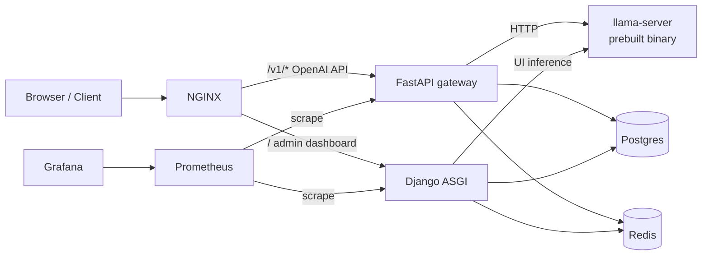

# Local LLM Inference Platform (Phase 1)

Production-minded **control plane** for running **llama.cpp** behind an **OpenAI-compatible** HTTP surface. Django validates requests, attaches observability, enforces policy (later phases), and **proxies** to a separate inference runtime. **Django never loads GGUF weights.**

This repository is intentionally built in **phases**. Phase 1 delivers: project skeleton, Docker Compose topology, ASGI streaming proxy, minimal Prometheus metrics, structured JSON logs with request IDs, and a small dark dashboard with live token streaming.

## What you get in Phase 1

- **OpenAI-compatible** `POST /v1/chat/completions` with **SSE streaming** and non-streaming JSON (via **FastAPI gateway** + nginx).
- **Inference backend abstraction** (`InferenceBackend` protocol) with an **HTTP llama.cpp** implementation (Django UI path; gateway uses httpx directly).
- **Observability hooks**: `/health/live`, `/health/ready`, `/metrics`, JSON logs, `X-Request-ID` propagation.
- **Docker Compose** wiring for Django, Postgres, Redis, NGINX, Prometheus, Grafana, and a `llamacpp` service.
- **Dashboard** (server-rendered templates + a tiny amount of JS for POST streaming).

## Architecture (Phase 1)



### Request lifecycle (streaming, programmatic)

1. **Client** sends `POST /v1/chat/completions` with `stream: true` to **NGINX** (Compose: `http://localhost:8888/...`).
2. **FastAPI gateway** verifies the **Bearer API key** (same HMAC digest as Django), applies **Redis RPM limits**, and proxies to `llamacpp:8080`.
3. The gateway **streams raw SSE bytes** from llama-server and records **structured logs** plus optional **Postgres audit rows** (`InferenceRequestLog`).
4. For **dashboard chat**, the browser still uses **Django** `POST /ui/v1/chat/completions` (session + CSRF); Django’s `ChatCompletionService` talks to llama-server directly.

Direct gateway (no nginx): `http://127.0.0.1:18081/v1/...` when Compose publishes the gateway port.

### Why this separation matters

- **Blast radius**: a bad prompt or a pathological decode loop should not take down your user database process. Keeping weights out of Django worker memory avoids huge RSS spikes in the web tier.
- **Scaling shape**: you can scale **stateless** Django replicas independently from **GPU/CPU-heavy** llama.cpp replicas (different autoscaling signals).
- **Release cadence**: you can roll a Django security patch without rebuilding a CUDA image (and vice versa).

## Repository layout

```
.
├── apps/
│   ├── api_keys/        # Phase 2: hashed keys, scopes, rotation
│   ├── benchmarks/      # Phase 4: load tests + regression harness
│   ├── dashboard/       # HTMX-friendly templates + minimal streaming JS
│   ├── inference/       # OpenAI surface + llama.cpp HTTP integration
│   ├── observability/   # logs, metrics, health, request correlation
│   └── users/           # Phase 2: profiles, orgs, quotas (optional custom user)
├── config/              # Django project settings (split by environment)
├── deploy/              # NGINX, Prometheus, Grafana, llama runtime, FastAPI gateway
├── docker-compose.yml
├── Dockerfile
├── models/              # GGUF mount directory (not read by Django)
├── static/              # dashboard assets
└── templates/           # server-rendered UI
```

## Quickstart (local, no Docker)

Requirements: **Python 3.12**.

```bash
python3.12 -m venv .venv
source .venv/bin/activate
pip install -r requirements.txt

export DJANGO_SETTINGS_MODULE=config.settings.development
export USE_REDIS=false
export LLAMA_CPP_BASE_URL=http://127.0.0.1:8080

python manage.py migrate
uvicorn config.asgi:application --reload --host 127.0.0.1 --port 8000
```

Open `http://127.0.0.1:8000/chat/` for the streaming UI.

## Quickstart (Docker Compose)

1. Copy env defaults:

```bash
cp .env.example .env
```

2. Put a GGUF file at `models/model.gguf` (or edit the `llamacpp` service command).

3. Bring the stack up:

```bash
docker compose up --build
```

4. Entry points:

- **App via NGINX**: `http://localhost:8888/`
- **Prometheus**: `http://localhost:9090/`
- **Grafana**: `http://localhost:3000/` (default `admin` / `admin` in compose)

> Note: the `ghcr.io/ggerganov/llama.cpp:server` image and CLI flags evolve. If the `llamacpp` container fails to start, treat the compose service as a **template** and pin to a known-good digest for your environment.

## Major engineering decisions (and tradeoffs)

### 1) Django ASGI + Uvicorn (not WSGI) for streaming

**Why**: `StreamingHttpResponse` backed by an async upstream iterator is the simplest way to keep a **single long-lived request** from blocking a synchronous worker thread pool.

**Tradeoff**: operational complexity vs Gunicorn sync workers. You will want explicit worker/timeouts at NGINX and a disciplined approach to idle streaming connections.

**Common failure**: NGINX buffering SSE despite `proxy_buffering off;` at the wrong config scope.

**Debugging**: compare direct-to-Uvicorn streaming vs through NGINX; watch `X-Request-ID` across logs.

### 2) “Forward bytes” streaming proxy (minimal parsing)

**Why**: re-implementing SSE parsing in Python is slow, error-prone, and couples you to every upstream nuance.

**Tradeoff**: you cannot accurately count tokens from streamed frames **unless** you parse chunks (planned enhancement: optional accounting side-channel or post-hoc tokenizer).

**Performance implication**: Django CPU stays low; throughput is dominated by llama.cpp and network chunk sizes.

### 3) Pydantic at the boundary, plain dict upstream

**Why**: strict validation gives stable error semantics for clients and prevents garbage from reaching the runtime.

**Tradeoff**: you must update models as you adopt more OpenAI fields (tools, JSON schema, multimodal).

### 4) Prometheus client in-process (not sidecar)

**Why**: lowest friction for a startup-internal platform; `/metrics` is standard.

**Tradeoff**: metrics reflect **per process** unless you adopt multiprocess mode for pre-fork workers.

**Security**: `/metrics` is sensitive; Phase 1 leaves it open for local iteration—**restrict by network policy** before any exposure.

### 5) Redis present but optional locally (`USE_REDIS`)

**Why**: developers run without Docker frequently.

**Tradeoff**: you must remember production compose sets `USE_REDIS=true` (already in `docker-compose.yml`).

## Phase roadmap

- **Phase 2 (current)**: Hashed API keys (`sk_local_…`), **FastAPI gateway** for Bearer `/v1/*` (nginx-routed), session+CSRF for `/ui/v1/*` on Django, per-key RPM limits (gateway + Redis), per-user daily quotas on the **UI** path (Django), redacted `InferenceRequestLog`, audit log for key lifecycle events, Prometheus on Django + gateway, optional llama readiness checks, and `docs/architecture.md`.
- **Phase 3**: hardened NGINX TLS, secrets management, systemd unit files, Grafana dashboards as code, production settings enforcement.
- **Phase 4**: benchmark harness, regression gates, performance tuning notes for CPU-first inference.

## CPU-first cost notes (preview)

- Throughput is mostly **llama.cpp threading**, KV cache behavior, batching/cont-batching, and model quantization—not Django.
- Django should remain “cheap”; if it isn’t, you’re usually doing too much work **per token** (logging, DB writes, heavy JSON transforms).

## License

Proprietary / unspecified — set a license before external distribution.
