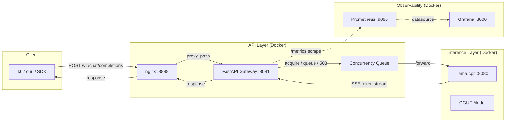

# AI Inference Gateway Platform

Production-grade LLM inference serving platform with concurrency control,
backpressure, comprehensive observability, and OpenAI-compatible streaming APIs.

```
Client → nginx :8888 → FastAPI Gateway :8081 → llama.cpp :8080 → GGUF Model
                           ↓                          ↑
                     Concurrency Queue          SSE token stream
                     Rate Limiter (Redis)       data: {...}
                     API Key Auth (Postgres)    data: [DONE]
                     Prometheus /metrics
```

---

## Architecture

```
┌─────────────────────────────────────────────────────────────────────┐
│  L1  CLIENT LAYER          k6 │ curl │ OpenAI SDK                    │
├─────────────────────────────────────────────────────────────────────┤
│  L2  API LAYER              nginx :8888 │ FastAPI Gateway :8081      │
│                             ┌──────────────────────────────────┐    │
│                             │  Concurrency Queue                │    │
│                             │  Rate Limiter (Redis)             │    │
│                             │  API Key Auth (Postgres)          │    │
│                             │  Structured Logging               │    │
│                             │  Prometheus /metrics              │    │
│                             └──────────────────────────────────┘    │
│                             Django Control Plane :8000              │
├─────────────────────────────────────────────────────────────────────┤
│  L3  INFERENCE LAYER       llama.cpp :8080 │ GGUF Mode              │
│                             ┌──────────────────────────────────┐    │
│                             │  Prompt Cache (KV reuse)         │    │
│                             │  SSE Token Stream                │    │
│                             └──────────────────────────────────┘    │
│                             Redis :6379 │ PostgreSQL :5432          │
├─────────────────────────────────────────────────────────────────────┤
│  L4  OBSERVABILITY LAYER   Prometheus :9090 │ Grafana :3000         │
│                             ┌──────────────────────────────────┐    │
│                             │  23-panel dashboard              │    │
│                             │  18 Prometheus recording rules   │    │
│                             └──────────────────────────────────┘    │
└─────────────────────────────────────────────────────────────────────┘
```

### Request flow



### Streaming lifecycle

1. **Client** sends `POST /v1/chat/completions` with `stream: true` to `nginx :8888`
2. **nginx** routes to **FastAPI Gateway :8081** (`proxy_buffering off` for SSE)
3. **Gateway** verifies Bearer API key (HMAC-SHA256, Postgres lookup, timing-safe compare)
4. **Gateway** checks rate limit (Redis `incr` 60s sliding window, fail-open on Redis outage)
5. **Gateway** acquires concurrency slot (`asyncio.Semaphore(4)`, queue depth 10, 30s timeout)
6. **Gateway** proxies to `llama.cpp :8080` — httpx streaming `aiter_bytes()`
7. **llama.cpp** streams SSE tokens back through the gateway
8. **Gateway** records metrics (TTFT, stream duration, token count, queue wait time)
9. **Gateway** persists audit log to Postgres (async `create_task`, 100-char redacted preview)
10. **Client** receives SSE chunks terminated by `data: [DONE]`

### Key design decisions

| Decision | Rationale |
|---|---|
| **Gateway single-worker ASGI** | Semaphore-based concurrency requires single event loop; multi-worker needs Redis distributed semaphore |
| **Gateway proxies directly to llama.cpp** | Django NOT in hot path — faster streaming, lower latency, independent scaling |
| **503 (not 429) for overload** | 503 signals server capacity exhaustion; 429 implies client is sending too fast |
| **Fail-open on Redis outage** | Availability over strict rate enforcement; rate limiting is operational protection, not security |
| **Prometheus in-process** | Lowest friction for internal platform; `/metrics` is standard pattern |
| **Queue tracking via plain int** | Atomic between `await` points in asyncio cooperative multitasking — no lock needed |

---

## Features

### Inference Gateway
- OpenAI-compatible `POST /v1/chat/completions` (streaming + non-streaming)
- `GET /v1/models` — lists available models from llama.cpp
- SSE streaming with `data: [DONE]` termination sentinel
- API key authentication — HMAC-SHA256 with timing-safe comparison
- Format: `sk_local_{public_id}_{secret}` (128-bit + 256-bit entropy)

### Concurrency Control
- `asyncio.Semaphore`-based slot limiting (configurable: `inference_max_concurrency`)
- Request queue with depth tracking (configurable: `inference_queue_size`)
- Queue timeout — 503 if slot not acquired in time (configurable: `inference_queue_timeout_s`)
- Overload rejection — 503 when queue is full
- Queue saturation monitoring via Prometheus gauge

### Observability (19 Prometheus metrics)
| Metric | Type | Labels | Description |
|---|---|---|---|
| `inference_chat_requests_total` | Counter | `mode` | Request count |
| `inference_time_to_first_token_seconds` | Histogram | — | TTFT distribution |
| `inference_upstream_wall_seconds` | Histogram | — | llama.cpp latency |
| `inference_streaming_duration_seconds` | Histogram | — | Stream session length |
| `inference_queue_wait_seconds` | Histogram | — | Time in concurrency queue |
| `inference_queue_depth` | Gauge | — | Current queue length |
| `inference_active_requests` | Gauge | `mode` | In-flight requests |
| `inference_streaming_requests_in_flight` | Gauge | — | Active streams |
| `inference_chat_completions_errors_total` | Counter | `kind` | Error breakdown |
| `inference_tokens_total` | Counter | `kind` | Completion token count |
| `inference_rejected_overload_total` | Counter | — | 503 rejection count |
| `inference_rate_limit_exceeded_total` | Counter | — | 429 rate limit hits |
| `gateway_process_uptime_seconds` | Gauge | — | Process uptime |
| `gateway_process_resident_memory_bytes` | Gauge | — | RSS |
| `gateway_process_cpu_percent` | Gauge | — | CPU % |

### Grafana Dashboard (23 panels)
- **Stat row**: Active Requests, Queue Depth, Overload Rejections, Request Rate, Error Rate, Upstream Timeouts
- **Latency**: Upstream Latency p50/p95/p99, TTFT p50/p95/p99, Queue Wait p50/p95/p99, Streaming Duration p50/p95/p99
- **Throughput**: Token Throughput, Request Rate by Mode, Streams In-Flight
- **Health**: Error Rate by Kind, Validation & Rejection Rate, Rate Limit & Quota Hits, Django Process Health, Gateway Process Health, Overload & Timeout Rate
- **Heatmap**: TTFT distribution over time

### Prometheus Recording Rules (18 rules)
- `inference:request_rate:5m`, `inference:error_rate:5m`, `inference:error_ratio:5m`
- `inference:upstream_latency_p50/p95/p99:5m`
- `inference:ttft_p50/p95/p99:5m`
- `inference:stream_duration_p50/p95:5m`
- `inference:token_throughput:1m`, `inference:token_throughput:5m`
- `inference:queue_saturation:1m`, `inference:active_requests:1m`
- `inference:gateway_memory_gb:1m`, `inference:gateway_cpu:1m`

### Resilience
- Graceful shutdown with 60s connection drain (`--timeout-graceful-shutdown`)
- Memory leak protection (`--limit-max-requests 10000`)
- `restart: unless-stopped` on all services
- Resource limits (llamacpp: 48g, gateway: 2g, nginx: 256m)
- Healthchecks with start periods on all services
- Llamacpp can restart independently — gateway returns 502/504 errors, stays up
- Redis fail-open — requests allowed during Redis outage
- Client disconnect handling — `CancelledError` caught, slot released, `client_disconnected` tracked

### Structured Logging
```json
{
  "level": "info",
  "event": "request_complete",
  "request_id": "abc-123",
  "route": "chat",
  "stream": true,
  "latency_ms": 45200,
  "ttft_ms": 3200,
  "bytes": 8240,
  "est_tokens_per_sec": 12.4,
  "queue_wait_ms": 1500,
  "api_key_id": "...",
  "status": 200,
  "error_kind": ""
}
```

---

## Quickstart

### Prerequisites
- Docker & Docker Compose
- A GGUF model file (e.g., Llama 3.2 3B Q4_K_M from Hugging Face)

### Setup

```bash
# 1. Copy environment defaults
cp .env.example .env

# 2. Place a GGUF model
#     curl -L -o models/model.gguf <hf-model-url>

# 3. Start the stack
docker compose up --build

# 4. Create an admin user (required — no registration UI exists)
docker compose exec django python manage.py createsuperuser

# 5. Create an API key
#     Open http://localhost:8888/staff/api-keys/ (login with the user above)
```

### Entry points

| Service | URL |
|---|---|
| App via nginx | `http://localhost:8888/` |
| Gateway direct | `http://127.0.0.1:18081/` |
| Prometheus | `http://localhost:9090/` |
| Grafana | `http://localhost:3000/` (admin/admin) |

### Test a request

```bash
# Streaming chat completion
curl -X POST http://localhost:8888/v1/chat/completions \
  -H "Authorization: Bearer sk_local_<your-key>" \
  -H "Content-Type: application/json" \
  -d '{
    "model": "default",
    "messages": [{"role": "user", "content": "Hello!"}],
    "stream": true,
    "max_tokens": 64
  }'

# Non-streaming
curl -X POST http://localhost:8888/v1/chat/completions \
  -H "Authorization: Bearer sk_local_<your-key>" \
  -H "Content-Type: application/json" \
  -d '{
    "model": "default",
    "messages": [{"role": "user", "content": "Hello!"}],
    "stream": false,
    "max_tokens": 64
  }'
```

---

## k6 Load Testing

Seven scripts in `loadtest/`:

| Script | Description | VUs | Duration |
|---|---|---|---|
| `chat-streaming.js` | Streaming completions with TTFT tracking | 5 | 3m |
| `chat-nonstreaming.js` | Non-streaming completions with usage validation | 10 | 3m |
| `chat-mixed.js` | Concurrent streaming + non-streaming scenarios | 4+6 | 3m |
| `chat-cancellation.js` | Client disconnect simulation + liveness check | 5 | ~50s |
| `chat-timeout.js` | Upstream timeout simulation + recovery check | 3 | ~50s |
| `spike-test.js` | Sudden burst (0→20→0 VUs) — tests backpressure | 20 | 2m |
| `soak-test.js` | Sustained moderate load, alternates streaming/non-streaming | 3 | 30m |

```bash
K6_API_KEY="sk_local_..." k6 run loadtest/spike-test.js
```

All scripts support `K6_API_KEY`, `K6_BASE_URL`, `K6_VUS` env vars.

---

## Configuration

Gateway settings (`deploy/gateway/gateway/config.py`):

| Variable | Default | Description |
|---|---|---|
| `inference_max_concurrency` | 4 | Max simultaneous llama.cpp calls |
| `inference_queue_size` | 10 | Max queued requests before 503 |
| `inference_queue_timeout_s` | 30.0 | Queue wait timeout before 503 |
| `gateway_persist_logs` | True | Persist request logs to Postgres |

---

## Repository layout

```
deploy/
├── gateway/              # FastAPI inference gateway
│   └── gateway/
│       ├── main.py       # Streaming + non-streaming handlers
│       ├── concurrency.py # Semaphore + queue with backpressure
│       ├── metrics.py    # 19 Prometheus metric families
│       ├── limits.py     # Redis rate limiter (fail-open)
│       ├── crypto_auth.py # HMAC-SHA256 API key auth
│       ├── runtime_metrics.py # Process RSS, CPU%, uptime
│       └── config.py     # Pydantic settings
├── prometheus/
│   ├── prometheus.yml    # Scrape config (django + gateway)
│   └── rules.yml         # 18 recording rules
├── grafana/
│   └── provisioning/
│       └── dashboards/
│           └── inference-dashboard.json  # 23 panels
├── nginx/
│   └── default.conf      # Route /v1/ to gateway, / to Django
└── llamacpp/             # Multi-arch llama.cpp Docker build

loadtest/                 # 7 k6 test scripts
docs/
├── architecture.md       # Full architecture reference
├── architecture-diagram.md # Diagram spec (Mermaid + Excalidraw)
├── performance.md        # Tuning guide and bottleneck analysis
└── load-testing.md       # k6 usage guide and scenario reference
```

---

## Production readiness

| Category | Status | Notes |
|---|---|---|
| Observability | 9/10 | 19 metrics, 23 Grafana panels, structured JSON logging, p50/p95/p99 latency |
| Concurrency | 8/10 | Semaphore + queue, proper 503, queue saturation tracking. Multi-worker needs Redis semaphore |
| Streaming | 8/10 | SSE, CancelledError handling, timeout/unavailable errors, `[DONE]` sentinel |
| Resilience | 7/10 | Redis fail-open, graceful shutdown, restart policies. Missing: circuit breaker |
| Security | 8/10 | HMAC-SHA256, timing-safe compare, Bearer auth, CSRF for UI, rate limiting |
| Docker | 8/10 | Multi-stage builds, healthchecks, resource limits, restart policies |
| Testing | 8/10 | 7 k6 scripts: streaming, non-streaming, mixed, cancellation, timeout, spike, soak |

---

## License

MIT
