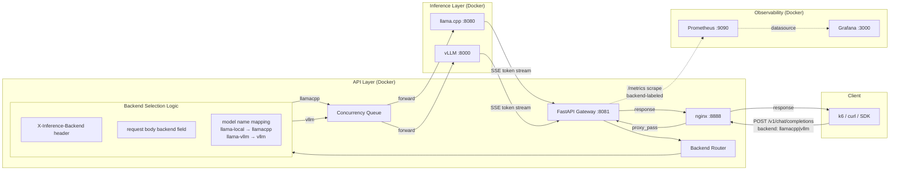
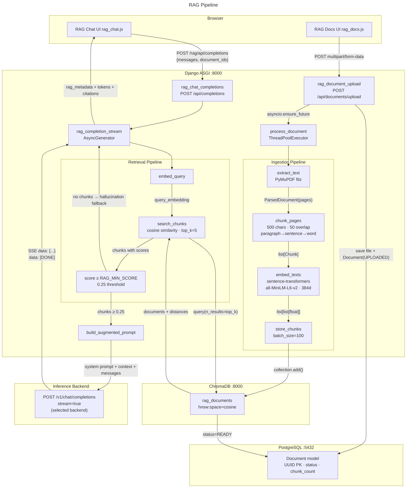

# AI Inference Gateway Platform

Production-grade LLM inference serving platform with concurrency control,
backpressure, comprehensive observability, and OpenAI-compatible streaming APIs.

```
Client → nginx :8888 → FastAPI Gateway :8081 ──→ llama.cpp :8080 → GGUF Model
                                                 ──→ vLLM :8000   → HF Model
                           ↓                          ↑
                     Concurrency Queue          SSE token stream
                     Request Batcher             data: {...}
                     Rate Limiter (Redis)       data: [DONE]
                     API Key Auth (Postgres)
                     Backend Router              Prometheus /metrics
                       • header backend selection   (backend-labeled)
                       • request body backend
                       • model name mapping

Django Control Plane :8000 ─── ChromaDB :8000 ─── sentence-transformers
       │
       ├── RAG Chat UI       →  /rag/chat/
       ├── PDF Upload         →  /rag/documents/
       ├── RAG API            →  /rag/api/completions
       ├── Agents UI          →  /agents/
       │   ├── List/Create    →  /agents/
       │   ├── Results        →  /agents/results/
       │   ├── Telegram       →  /agents/telegram/
       │   └── API            →  /agents/api/
       └── Agent Scheduler    →  APScheduler → AgentRunner → Pipelines
```

---

## Architecture

```
┌─────────────────────────────────────────────────────────────────────┐
│  L1  CLIENT LAYER          k6 │ curl │ OpenAI SDK                    │
├─────────────────────────────────────────────────────────────────────┤
│  L2  API LAYER              nginx :8888 │ FastAPI Gateway :8081      │
│                             ┌──────────────────────────────────┐    │
│                             │  Concurrency Queue                │    │
│                             │  Request Batcher (50ms window)    │    │
│                             │  Rate Limiter (Redis)             │    │
│                             │  API Key Auth (Postgres)          │    │
│                             │  Backend Router                    │    │
│                             │    • header / body / model map    │    │
│                             │  Structured Logging               │    │
│                             │  Prometheus /metrics              │    │
│                             │    (backend-labeled)              │    │
│                             └──────────────────────────────────┘    │
│                             Django Control Plane :8000              │
├─────────────────────────────────────────────────────────────────────┤
│  L3  INFERENCE LAYER       llama.cpp :8080 │ GGUF Model             │
│                             ┌──────────────────────────────────┐    │
│                             │  Server-side slot batching       │    │
│                             │  Prompt Cache (KV reuse)         │    │
│                             │  SSE Token Stream                │    │
│                             └──────────────────────────────────┘    │
│                                                  ┌──────────────────┐│
│                             vLLM :8000           │  PagedAttention  ││
│                             (HF Model)           │  Continuous Bat. ││
│                                                  │  Prefix Caching  ││
│                                                  │  Chunked Prefill ││
│                                                  └──────────────────┘│
│                             Redis :6379 │ PostgreSQL :5432          │
├─────────────────────────────────────────────────────────────────────┤
│  L4  OBSERVABILITY LAYER   Prometheus :9090 │ Grafana :3000         │
│                             │  RAG Pipeline (Django)             │    │
│                             │    PDF Ingestion → Chunk → Embed   │    │
│                             │    ChromaDB → Retrieve → Augment    │    │
│                             │    sentence-transformers (384d)     │    │
│                             │  Dual-backend comparison panels    │    │
│                             └──────────────────────────────────┘    │
│                             ChromaDB :8000 (persistent vectors)     │
├─────────────────────────────────────────────────────────────────────┤
│  L4  OBSERVABILITY LAYER   Prometheus :9090 │ Grafana :3000         │
│                             ┌──────────────────────────────────┐    │
│                             │  43 panels (36 existing + 7      │    │
│                             │    comparison panels)            │    │
│                             │  32 Prometheus recording rules   │    │
│                             └──────────────────────────────────┘    │
└─────────────────────────────────────────────────────────────────────┘
```

### Request flow



### Streaming lifecycle

1. **Client** sends `POST /v1/chat/completions` with `stream: true` to `nginx :8888`
2. **nginx** routes to **FastAPI Gateway :8081** (`proxy_buffering off` for SSE)
3. **Gateway** verifies Bearer API key (HMAC-SHA256, Postgres lookup, timing-safe compare)
4. **Gateway** checks rate limit (Redis `incr` 60s sliding window, fail-open on Redis outage)
5. **Gateway** acquires concurrency slot (`asyncio.Semaphore(4)`, queue depth 10, 30s timeout)
6. **Gateway** enters batch barrier — waits for other concurrent requests (default 50ms window, max 8 per batch)
7. **Batch dispatches** — all accumulated requests are released simultaneously
8. **Gateway** proxies to `llama.cpp :8080` — httpx streaming `aiter_bytes()` (concurrent with batch peers)
9. **llama.cpp** streams SSE tokens back through the gateway (server-side slot batching improves prompt processing)
10. **Gateway** records metrics (TTFT, stream duration, token count, queue wait time, batch wait time)
11. **Gateway** persists audit log to Postgres (async `create_task`, 100-char redacted preview)
12. **Client** receives SSE chunks terminated by `data: [DONE]`

### Backend selection (multi-backend routing)

Requests can target either backend via four mechanisms (checked in order):

1. **Request body `"backend"` field**: `{"backend": "vllm", ...}`
2. **HTTP header**: `X-Inference-Backend: vllm`
3. **Model name mapping**: `llama-local` → llama.cpp, `llama-vllm` → vLLM
4. **Frontend chat UI** — dropdown selector at `http://localhost:8888/chat/`

If none are provided, the `DEFAULT_BACKEND` setting (default `"llamacpp"`) is used.

The backend field is stripped from the payload before forwarding upstream — neither llama.cpp nor vLLM see it.

### Key design decisions

| Decision | Rationale |
|---|---|
| **Gateway single-worker ASGI** | Semaphore-based concurrency requires single event loop; multi-worker needs Redis distributed semaphore |
| **Gateway proxies directly to llama.cpp/vLLM** | Django NOT in hot path — faster streaming, lower latency, independent scaling |
| **503 (not 429) for overload** | 503 signals server capacity exhaustion; 429 implies client is sending too fast |
| **Fail-open on Redis outage** | Availability over strict rate enforcement; rate limiting is operational protection, not security |
| **Prometheus in-process** | Lowest friction for internal platform; `/metrics` is standard pattern |
| **Queue tracking via plain int** | Atomic between `await` points in asyncio cooperative multitasking — no lock needed |
| **Dispatch-time batching (not request fusion)** | Requests are held briefly then released simultaneously, letting the backend batch prompt processing internally. No HTTP body merging needed — preserves per-request streaming and OpenAI compatibility |
| **Batching after concurrency slot acquisition** | Slots are held during batching wait, maintaining proper backpressure. Without this, the batch could grow unbounded while the upstream is saturated |
| **Small default window (50ms)** | Balances TTFT increase against batching opportunity. Under light load, 50ms penalty is negligible. Under heavy load, multiple requests accumulate within the window |
| **Backend routing in gateway** | Backend selection happens at the gateway before the batch barrier, so batching is per-backend-aware. The `backend` field is stripped from the payload before forwarding |
| **sentence-transformers for embeddings** | Embedding via llama.cpp is ~1-2s per chunk; sentence-transformers/all-MiniLM-L6-v2 is ~10ms. 100× faster for bulk ingestion |
| **ChromaDB over pgvector** | Purpose-built for vector search with cosine similarity, HNSW indexing, and metadata filtering |
| **RAG in Django (not gateway)** | Django owns the ORM, admin UI, templates, and session auth. RAG in Django avoids cross-service file transfers |

---

## Features

### Inference Gateway
- OpenAI-compatible `POST /v1/chat/completions` (streaming + non-streaming)
- `GET /v1/models` — lists available models from both backends (merged)
- SSE streaming with `data: [DONE]` termination sentinel
- API key authentication — HMAC-SHA256 with timing-safe comparison
- Format: `sk_local_{public_id}_{secret}` (128-bit + 256-bit entropy)

### Multi-Backend Routing
- **Backend selection**: `backend` field in request body, `X-Inference-Backend` header, model name mapping, or frontend chat UI dropdown
- **Model mapping**: `llama-local` → llama.cpp, `llama-vllm` → vLLM
- **Default backend**: Configurable via `DEFAULT_BACKEND` (default `"llamacpp"`)
- **Transparent proxying**: The `backend` field is stripped before forwarding upstream
- **Django integration**: RAG pipeline and UI chat support backend selection via `DEFAULT_INFERENCE_BACKEND`
- **Frontend selector**: Dropdown at `http://localhost:8888/chat/` lets users switch between llama.cpp and vLLM per request

### Request Batching
- **Dispatch-time batching** — concurrent requests arriving within a configurable window (default 50ms) are released simultaneously
- **Configurable max batch size** (default 8) — limits worst-case batch wait
- **No HTTP body merging** — preserves per-request streaming and OpenAI compatibility
- **Safe fallback** — single requests flush after the window timeout with no starvation risk
- **Algorithm**: `asyncio.Event`-based barrier with generation counter to prevent stale timer flushes

### Concurrency Control
- `asyncio.Semaphore`-based slot limiting (configurable: `inference_max_concurrency`)
- Request queue with depth tracking (configurable: `inference_queue_size`)
- Queue timeout — 503 if slot not acquired in time (configurable: `inference_queue_timeout_s`)
- Overload rejection — 503 when queue is full
- Queue saturation monitoring via Prometheus gauge

### Observability (25 + 10 backend-specific Prometheus metrics)

| Metric | Type | Labels | Description |
|---|---|---|---|
| `inference_chat_requests_total` | Counter | `mode` | Request count |
| `inference_time_to_first_token_seconds` | Histogram | — | TTFT distribution |
| `inference_upstream_wall_seconds` | Histogram | — | Upstream latency |
| `inference_streaming_duration_seconds` | Histogram | — | Stream session length |
| `inference_queue_wait_seconds` | Histogram | — | Time in concurrency queue |
| `inference_queue_depth` | Gauge | — | Current queue length |
| `inference_active_requests` | Gauge | `mode` | In-flight requests |
| `inference_streaming_requests_in_flight` | Gauge | — | Active streams |
| `inference_chat_completions_errors_total` | Counter | `kind` | Error breakdown |
| `inference_tokens_total` | Counter | `kind` | Completion token count |
| `inference_rejected_overload_total` | Counter | — | 503 rejection count |
| `inference_rate_limit_exceeded_total` | Counter | — | 429 rate limit hits |
| `gateway_process_uptime_seconds` | Gauge | — | Process uptime |
| `gateway_process_resident_memory_bytes` | Gauge | — | RSS |
| `gateway_process_cpu_percent` | Gauge | — | CPU % |
| `inference_batch_dispatches_total` | Counter | — | Batch dispatch count |
| `inference_batch_single_dispatches_total` | Counter | — | Single-request batch count |
| `inference_batch_size` | Histogram | — | Requests per batch |
| `inference_batch_wait_seconds` | Histogram | — | Time in batch barrier |
| `inference_batch_queue_depth` | Gauge | — | Current barrier queue |
| `inference_batch_efficiency` | Gauge | — | Cumulative batching efficiency |
| `inference_backend_chat_requests_total` | Counter | `backend`, `mode` | Request count by backend |
| `inference_backend_ttft_seconds` | Histogram | `backend` | TTFT by backend |
| `inference_backend_upstream_seconds` | Histogram | `backend` | Upstream latency by backend |
| `inference_backend_streaming_duration_seconds` | Histogram | `backend` | Stream duration by backend |
| `inference_backend_active_requests` | Gauge | `backend`, `mode` | Active requests by backend |
| `inference_backend_streaming_in_flight` | Gauge | `backend` | Active streams by backend |
| `inference_backend_chat_completions_errors_total` | Counter | `backend`, `kind` | Errors by backend |
| `inference_backend_tokens_total` | Counter | `backend`, `kind` | Tokens by backend |
| `inference_backend_upstream_timeouts_total` | Counter | `backend` | Timeouts by backend |
| `inference_backend_rejected_overload_total` | Counter | `backend` | Overload rejections by backend |

### Grafana Dashboard (36 + 7 comparison panels)

**Existing panels (36):** Stat row (Active Requests, Queue Depth, Overload Rejections, Request Rate, Error Rate), Latency (Upstream p50/p95/p99, TTFT p50/p95/p99, Queue Wait p50/p95/p99, Streaming Duration p50/p95/p99), Throughput (Token Throughput, Request Rate by Mode, Streams In-Flight), Health (Error Rate by Kind, Validation & Rejection, Rate Limit & Quota, Process Health), Heatmap (TTFT distribution), Batching (Queue Depth, Efficiency, Avg Batch Size, Dispatch Rate, Size Over Time, Wait Time), RAG panels (7)

**Comparison panels (7):** TTFT Comparison (p50/p95), Upstream Latency Comparison (p50/p95), Request Rate by Backend, Token Throughput by Backend, Error Rate by Backend, Active Requests by Backend, Streaming In-Flight by Backend

**Template variables:** `datasource` (Prometheus), `mode` (All/streaming/non-streaming), `backend` (All/llamacpp/vllm)

### Prometheus Recording Rules (32 rules)

**Existing (25):** Request rate (1m/5m), Error rate (5m), Timeout rate (5m), Overload rate (5m), Error ratio (5m), Upstream latency p50/p95/p99 (5m), TTFT p50/p95/p99 (5m), Stream duration p50/p95 (5m), Queue wait p50/p95 (5m), Token throughput (1m/5m), Queue saturation (1m), Active requests (1m), Streaming in-flight (1m), Batch avg size (5m), Batch wait p50/p95 (5m), Batch efficiency (5m), Batch single ratio (5m), Gateway memory (1m), Gateway CPU (1m)

**Backend comparison (7 new):** `inference:backend_request_rate:1m`, `inference:backend_error_rate:5m`, `inference:backend_ttft_p50/p95/p99:5m`, `inference:backend_upstream_latency_p50/p95/p99:5m`, `inference:backend_token_throughput:1m`, `inference:backend_active_requests:1m`, `inference:backend_timeout_rate:5m`

### RAG Pipeline

A production-style Retrieval-Augmented Generation system integrated into the existing control plane. Users upload PDFs, documents are chunked and embedded, and chat responses are grounded in retrieved context with explicit source citations.

**Architecture:**



**Anti-Hallucination Strategy:**

| Layer | Mechanism |
|---|---|
| **Confidence threshold** | `RAG_MIN_SCORE=0.25` — chunks below this cosine similarity are discarded. If no chunks survive, the model explicitly says "not found" |
| **System prompt** | Hard-coded instruction: "Answer based ONLY on the provided context. Do NOT use your training data." |
| **Source grounding** | Every chunk is prefixed with `[Source: {document_id}, page {page}]` |
| **No fabricated citations** | Citation data comes from actual retrieval metadata, not model output. Sent as `rag_metadata` SSE events |
| **Context window limit** | `RAG_MAX_CONTEXT_CHARS=8000` prevents oversized prompts |

**RAG Observability (10 Prometheus metrics):**

| Metric | Type | Description |
|---|---|---|
| `rag_completions_total` | Counter | Total RAG-augmented chat completions |
| `rag_hallucination_fallbacks_total` | Counter | "Not found in documents" responses |
| `rag_retrieval_latency_seconds` | Histogram | Time to embed query + ChromaDB search + filter |
| `rag_retrieved_chunks_per_query` | Histogram | Number of chunks returned per query |
| `rag_ingestion_duration_seconds` | Histogram | Time to fully process a document |
| `rag_embedding_latency_seconds` | Histogram | Time per embedding batch |
| `rag_vector_db_latency_seconds` | Histogram | Raw ChromaDB query time |
| `rag_documents_uploaded_total` | Counter | Total documents uploaded |
| `rag_chunks_stored_total` | Counter | Total chunks stored |
| `rag_documents_ready` | Gauge | Number of successfully indexed documents |

**Grafana Dashboard — 7 RAG panels:**

- **RAG Request Rate** (stat) — RAG completions per second
- **RAG Hallucination Fallbacks** (stat) — "not found" count, alerts on model hallucination risk
- **Documents Ready** (stat) — number of indexed documents
- **Ingestion & Chunks Rate** (stat) — document upload rate
- **Retrieval Latency p50/p95** (timeseries) — time to embed, search, and filter
- **Avg Chunks Retrieved per Query** (timeseries) — retrieval depth over time
- **Ingestion Duration** (timeseries) — document processing time (healthy baseline tracking)

**Prometheus Recording Rules — 7 RAG rules:**

- `rag:request_rate:1m`, `rag:retrieval_latency_p50:5m`, `rag:retrieval_latency_p95:5m`
- `rag:hallucination_fallback_rate:5m`, `rag:avg_chunks_per_query:5m`
- `rag:documents_ready:1m`, `rag:ingestion_rate:5m`

**RAG Configuration (Django settings / .env):**

| Variable | Default | Description |
|---|---|---|
| `RAG_ENABLED` | `true` | Feature toggle |
| `RAG_CHUNK_SIZE` | 500 | Characters per chunk |
| `RAG_CHUNK_OVERLAP` | 50 | Overlap between consecutive chunks (chars) |
| `RAG_TOP_K` | 5 | Number of chunks retrieved per query |
| `RAG_MIN_SCORE` | 0.25 | Minimum cosine similarity for chunk inclusion |
| `RAG_EMBEDDING_MODEL` | `all-MiniLM-L6-v2` | sentence-transformers model name |
| `RAG_MAX_CONTEXT_CHARS` | 8000 | Max context characters sent to the model |
| `CHROMADB_HOST` | `chromadb` | ChromaDB Docker service host |
| `CHROMADB_PORT` | 8000 | ChromaDB HTTP API port |

## vLLM Backend

vLLM is an open-source LLM serving engine by UC Berkeley's LMSys, designed for high-throughput serving with PagedAttention. Unlike llama.cpp's slot-based batching, vLLM uses continuous batching and a paged KV cache.

### Architectural differences

| Aspect | llama.cpp | vLLM |
|--------|-----------|------|
| **Batching** | Server-side slot batching (`--parallel N`). Each slot is a pre-allocated KV cache partition. Slots are static — a request holds a slot until complete | Continuous batching. Requests are added/removed from the active batch after each iteration. No slot pre-allocation — KV cache pages are allocated on demand |
| **KV Cache** | Contiguous memory per slot. Fixed size = `ctx-size / parallel`. Wasted memory when slots are partially used | PagedAttention — KV cache is stored in fixed-size pages (blocks), allocated on demand. Near-zero wasted memory. Enables higher effective batch sizes |
| **Memory efficiency** | Lower — each slot reserves `ctx-size / parallel` tokens of KV cache even if the request uses fewer | Higher — KV cache pages are allocated per-token, so total memory used matches actual usage across all requests |
| **Prefill** | First token computed synchronously per slot. Batch-aware prefill (processes multiple prompts together) | Chunked prefill (optional) — long prompts can be split into chunks that interleave with decode. Reduces TTFT for concurrent requests |
| **Prefix caching** | Manual via prompt cache (KV reuse for identical prefixes) | Automatic — PagedAttention's block-level caching can reuse KV pages across requests with common prefixes |
| **Model format** | GGUF (quantized, single-file). Supports 2–8 bit quantization | HuggingFace format (SafeTensors). Typically FP16/BF16. Requires more memory/VRAM but higher precision |
| **Quantization** | Native GGUF quantization (Q2–Q8, IQ). Run a 70B model in 32GB RAM | AWQ/GPTQ via external quantization. No native quantization in the serving path |
| **CPU support** | First-class CPU support with ggml backend. Optimized for ARM NEON, x86 AVX2 | Experimental CPU backend (`--device cpu`). Significantly slower than GPU. Not production-ready for CPU |
| **GPU support** | CUDA/ROCm via ggml. Good performance but less optimized than vLLM for GPU | First-class GPU support with CUDA kernels. FlashAttention, continuous batching, PagedAttention all GPU-native |
| **Startup time** | Fast — loads GGUF directly, no conversion | Slower — loads Safetensors, builds CUDA graphs, compiles kernels |
| **OpenAI API** | Built-in `llama-server` with `/v1/chat/completions` | Native OpenAI-compatible server |

### Why vLLM differs architecturally

**PagedAttention**: vLLM's key innovation. Traditional KV cache is stored as a contiguous 2D tensor `[num_layers, 2, num_heads, seq_len, head_dim]`. This causes:

- **Internal fragmentation**: Each request's KV cache is pre-allocated for the maximum context length, regardless of actual usage
- **External fragmentation**: Memory cannot be shared across sequences even when they share prefixes (like system prompts)

PagedAttention solves this by storing KV cache in fixed-size blocks (pages). Each block holds KV for a fixed number of tokens (typically 16). Blocks are mapped via a block table — analogous to virtual memory paging in operating systems. This enables:

- **Near-zero fragmentation**: Blocks are allocated on demand as tokens are generated
- **Memory sharing**: Multiple sequences can share blocks for common prefixes (system prompts, few-shot examples)
- **Larger effective batch sizes**: More requests fit in the same memory budget

**Continuous batching**: Unlike llama.cpp's static slots, vLLM evaluates the active batch after each iteration. Completed sequences are removed immediately and new sequences can join on the next iteration. This maximizes GPU utilization during decode — when some sequences generate EOS tokens early, their slots are immediately reclaimed.

**Chunked prefill**: Long prompts cause high TTFT because the prefill phase is compute-bound and blocks decode for all other sequences. Chunked prefill splits the prefill into smaller chunks that interleave with decode steps, reducing TTFT variance at the cost of slightly longer overall prefill.

### Benchmark methodology (llama.cpp vs vLLM)

Comparison tests should control for:

1. **Same model weights**: Quantization differences (GGUF Q4_K_M vs FP16) inherently favor vLLM on quality but penalize it on latency. For fair comparison, use an equivalently quantized model or disable quantization entirely
2. **Same hardware**: Both backends must run on the same machine. GPU-only benchmarks force vLLM to GPU and llama.cpp to CPU, which is an apples-to-oranges comparison
3. **Same concurrency level**: Set `INFERENCE_MAX_CONCURRENCY` identically for both. vLLM may benefit from higher concurrency due to continuous batching
4. **Same prompt/response lengths**: Use fixed-size prompts and `max_tokens` to isolate backend behavior from prompt variance

### Expected performance differences

| Workload | Expected winner | Reason |
|----------|---------------|--------|
| Single request, low latency | llama.cpp (CPU) / vLLM (GPU) | On CPU, llama.cpp's ggml is heavily optimized. On GPU, vLLM's CUDA kernels are faster |
| Many concurrent requests | vLLM | Continuous batching + PagedAttention enable higher throughput under load. Fewer memory constraints |
| Long context (32K+) | vLLM | PagedAttention handles long contexts without quadratic memory growth. llama.cpp requires slot pre-allocation |
| Mixed prompt lengths | vLLM | Chunked prefill prevents long prompts from blocking short ones |
| CPU-only deployment | llama.cpp | vLLM's CPU backend is experimental. ggml is production-grade for CPU |
| Streaming TTFT | vLLM (GPU only) | Chunked prefill reduces TTFT for long prompts under concurrency |
| Memory-constrained | llama.cpp (via GGUF quantization) | Q4_K_M quantized models use ~4.5 bits/param. FP16 models use 16 bits/param |

### Tuning notes

**llama.cpp**:
- `--parallel N` must match `inference_max_concurrency` in the gateway
- `--ctx-size` determines per-slot context: `ctx-size / parallel` tokens each
- `--batch-size` and `--ubatch-size` control prefill batching. Larger = faster prompt processing
- Thread count should be `physical_cores - 1` on shared machines

**vLLM**:
- `--max-num-seqs` controls the maximum number of sequences in a batch. Higher = more throughput at the cost of latency
- `--enable-chunked-prefill` helps reduce TTFT under concurrency but increases per-token overhead
- `--gpu-memory-utilization` sets the fraction of GPU memory for KV cache (default 0.90)
- `--max-model-len` limits the maximum sequence length. Reducing this increases the available KV cache budget
- For CPU: `--device cpu` enables the experimental CPU backend

### Bottleneck analysis

| Bottleneck | llama.cpp | vLLM |
|-----------|-----------|------|
| **Prompt processing** | Prefill is single-threaded for a single request; batched across parallel slots | Batch-aware prefill with FlashAttention. Faster for concurrent prompts |
| **Token generation** | Thread pool across CPU cores. Memory-bound (GGUF format means fewer bytes/param) | GPU compute-bound. Faster per-token on GPU, but memory-bound with small batch sizes |
| **Memory (KV cache)** | Slot-based allocation. `ctx-size / parallel` per slot. Fixed cost regardless of usage | Paged allocation. Cost proportional to actual sequence length |
| **Request throughput** | Limited by slot count (`--parallel`). Saturated slots cause queuing | Limited by GPU memory. Higher effective throughput from tight packing |
| **Queue buildup** | Gateway queue fills when all parallel slots are occupied | Higher threshold before queue builds, but TTFT increases as batch grows |

### Strengths and weaknesses summary

**llama.cpp strengths**:
- First-class CPU support with SIMD optimization (ARM NEON, x86 AVX2/AVX512)
- GGUF quantization (Q2–Q8) allows large models to run on limited hardware
- Fast startup — no model conversion or kernel compilation
- Single-binary deployment
- Mature, well-documented CPU inference

**llama.cpp weaknesses**:
- Static slot allocation wastes KV cache memory
- No continuous batching — slot released only after sequence completion
- GPU support less optimized than vLLM
- Prefix caching is manual (prompt cache), not automatic at the token level

**vLLM strengths**:
- PagedAttention eliminates KV cache fragmentation
- Continuous batching maximizes GPU utilization
- Chunked prefill reduces TTFT variance
- Native FP16/BF16 inference — no quality loss from quantization
- Automatic prefix caching
- Production-grade OpenAI API server

**vLLM weaknesses**:
- GPU-native design — CPU backend is experimental and slow
- Higher memory requirements — FP16 models are ~2× the size of Q4 GGUF
- Longer startup time — loads model weights, builds CUDA graphs
- Less flexibility in quantization — requires external AWQ/GPTQ tooling
- More complex deployment — larger image, more dependencies

### Resilience
- Graceful shutdown with 60s connection drain (`--timeout-graceful-shutdown`)
- Memory leak protection (`--limit-max-requests 10000`)
- `restart: unless-stopped` on all services
- Resource limits (llamacpp: 48g, gateway: 2g, nginx: 256m)
- Healthchecks with start periods on all services
- Llamacpp can restart independently — gateway returns 502/504 errors, stays up
- Redis fail-open — requests allowed during Redis outage
- Client disconnect handling — `CancelledError` caught, slot released, `client_disconnected` tracked

### Structured Logging
```json
{
  "level": "info",
  "event": "request_complete",
  "request_id": "abc-123",
  "route": "chat",
  "stream": true,
  "latency_ms": 45200,
  "ttft_ms": 3200,
  "bytes": 8240,
  "est_tokens_per_sec": 12.4,
  "queue_wait_ms": 1500,
  "api_key_id": "...",
  "status": 200,
  "error_kind": ""
}
```

---

## Quickstart

### Prerequisites
- Docker & Docker Compose
- A GGUF model file (e.g., Llama 3.2 3B Q4_K_M from Hugging Face)

### Setup

```bash
# 1. Copy environment defaults
cp .env.example .env

# 2. Place a GGUF model
#     curl -L -o models/model.gguf <hf-model-url>

# 3. Start the stack
docker compose up --build

# 4. Create an admin user (required — no registration UI exists)
docker compose exec django python manage.py createsuperuser

# 5. Create an API key
#     Open http://localhost:8888/staff/api-keys/ (login with the user above)
```

### Entry points

| Service | URL |
|---|---|
| App via nginx | `http://localhost:8888/` |
| Gateway direct | `http://127.0.0.1:18081/` |
| Prometheus | `http://localhost:9090/` |
| Grafana | `http://localhost:3000/` (admin/admin) |

### Test a request

```bash
# Streaming chat completion (default backend — llama.cpp)
curl -X POST http://localhost:8888/v1/chat/completions \
  -H "Authorization: Bearer sk_local_<your-key>" \
  -H "Content-Type: application/json" \
  -d '{
    "model": "default",
    "messages": [{"role": "user", "content": "Hello!"}],
    "stream": true,
    "max_tokens": 64
  }'

# Non-streaming (default backend)
curl -X POST http://localhost:8888/v1/chat/completions \
  -H "Authorization: Bearer sk_local_<your-key>" \
  -H "Content-Type: application/json" \
  -d '{
    "model": "default",
    "messages": [{"role": "user", "content": "Hello!"}],
    "stream": false,
    "max_tokens": 64
  }'

# Target specific backend via request body
curl -X POST http://localhost:8888/v1/chat/completions \
  -H "Authorization: Bearer sk_local_<your-key>" \
  -H "Content-Type: application/json" \
  -d '{
    "model": "default",
    "messages": [{"role": "user", "content": "Hello from vLLM!"}],
    "stream": true,
    "max_tokens": 64,
    "backend": "vllm"
  }'

# Target specific backend via HTTP header
curl -X POST http://localhost:8888/v1/chat/completions \
  -H "Authorization: Bearer sk_local_<your-key>" \
  -H "Content-Type: application/json" \
  -H "X-Inference-Backend: vllm" \
  -d '{
    "model": "default",
    "messages": [{"role": "user", "content": "Hello from vLLM!"}],
    "stream": true,
    "max_tokens": 64
  }'

# Use model name mapping
curl -X POST http://localhost:8888/v1/chat/completions \
  -H "Authorization: Bearer sk_local_<your-key>" \
  -H "Content-Type: application/json" \
  -d '{
    "model": "llama-vllm",
    "messages": [{"role": "user", "content": "This routes to vLLM via model mapping!"}],
    "stream": true,
    "max_tokens": 64
  }'
```

---

## k6 Load Testing

Nine profiling scripts + 3 benchmark scripts in `loadtest/`:

### Profiling scripts

| Script | Description | VUs | Duration |
|---|---|---|---|---|
| `chat-streaming.js` | Streaming completions with TTFT tracking | 5 | 3m |
| `chat-nonstreaming.js` | Non-streaming completions with usage validation | 10 | 3m |
| `chat-mixed.js` | Concurrent streaming + non-streaming scenarios | 4+6 | 3m |
| `chat-batch.js` | Constant-arrival-rate streaming — exercises batch barrier | 10 | 3m |
| `chat-step-stress.js` | Step stress test: 2→14 VUs in 1m steps — finds saturation knee | 14 | 7.5m |
| `chat-cancellation.js` | Client disconnect simulation + liveness check | 5 | ~50s |
| `chat-timeout.js` | Upstream timeout simulation + recovery check | 3 | ~50s |
| `spike-test.js` | Sudden burst (0→20→0 VUs) — tests backpressure | 20 | 2m |
| `soak-test.js` | Sustained moderate load, alternates streaming/non-streaming | 3 | 30m |

### Benchmark scripts (llama.cpp vs vLLM)

| Script | Description | Default VUs | Duration |
|---|---|---|---|---|
| `benchmark-llamacpp.js` | All requests routed to llama.cpp via `backend: "llamacpp"` | 4 | 5m |
| `benchmark-vllm.js` | All requests routed to vLLM via `backend: "vllm"` | 4 | 5m |
| `benchmark-headtohead.js` | Alternates between both backends — half VUs per backend | 6 (3+3) | 5m |

```bash
# Run single-backend benchmark
K6_API_KEY="sk_local_..." k6 run loadtest/benchmark-llamacpp.js
K6_API_KEY="sk_local_..." k6 run loadtest/benchmark-vllm.js

# Run head-to-head comparison (produces side-by-side metrics)
K6_API_KEY="sk_local_..." k6 run loadtest/benchmark-headtohead.js

# Override the default backend in a benchmark (e.g. benchmark llamacpp against vllm)
K6_API_KEY="sk_local_..." K6_BACKEND=vllm k6 run loadtest/benchmark-llamacpp.js

# Customize backends in head-to-head comparison
K6_API_KEY="sk_local_..." K6_BACKEND_A=vllm K6_BACKEND_B=llamacpp k6 run loadtest/benchmark-headtohead.js

# Customize concurrency and duration
K6_API_KEY="sk_local_..." K6_VUS=8 K6_DURATION="10m" k6 run loadtest/benchmark-headtohead.js
```

### Backend switching

All 12 load test scripts accept `K6_BACKEND` to target a specific backend:

```bash
# Route profiling traffic to vLLM instead of the default
K6_API_KEY="sk_local_..." K6_BACKEND=vllm k6 run loadtest/chat-streaming.js

# Route to llama.cpp explicitly
K6_API_KEY="sk_local_..." K6_BACKEND=llamacpp k6 run loadtest/chat-streaming.js
```

When unset, the request uses the gateway's `DEFAULT_BACKEND` (configurable via `default_backend` in the gateway settings).

### Environment variables

| Variable | Scripts | Default | Description |
|---|---|---|---|
| `K6_API_KEY` | All | — | Bearer token for API key auth (required) |
| `K6_BASE_URL` | All | `http://localhost:8888` | Target gateway URL |
| `K6_VUS` | All | varies by script | Virtual users / concurrency level |
| `K6_DURATION` | Varies | varies by script | Test duration |
| `K6_BACKEND` | All profiling, benchmarks | gateway default | Target backend: `llamacpp` or `vllm` |
| `K6_BACKEND_A` | `benchmark-headtohead` | `llamacpp` | First backend in head-to-head comparison |
| `K6_BACKEND_B` | `benchmark-headtohead` | `vllm` | Second backend in head-to-head comparison |

---

## Configuration

Gateway settings (`deploy/gateway/gateway/config.py`):

| Variable | Default | Description |
|---|---|---|
| `inference_max_concurrency` | 4 | Max simultaneous inference calls. Must match backend concurrency capacity |
| `inference_queue_size` | 10 | Max queued requests before 503 |
| `inference_queue_timeout_s` | 30.0 | Queue wait timeout before 503 |
| `batch_window_ms` | 50.0 | Time window for aggregating requests into a batch (ms) |
| `batch_max_size` | 8 | Maximum requests per batch |
| `gateway_persist_logs` | True | Persist request logs to Postgres |
| `upstream_llama_url` | `http://llamacpp:8080` | llama.cpp OpenAI-compatible API base URL |
| `upstream_vllm_url` | `http://vllm:8000` | vLLM OpenAI-compatible API base URL |
| `default_backend` | `llamacpp` | Default backend when none is specified by the client |

### Backend selection

Clients can target a specific backend via three mechanisms (checked in order):

1. **Request body**: `{"backend": "vllm", ...}`
2. **HTTP header**: `X-Inference-Backend: vllm`
3. **Model name mapping**: `llama-local` → llama.cpp, `llama-vllm` → vLLM

### llama.cpp parallel slots

### llama.cpp parallel slots

The gateway's `inference_max_concurrency` must match llama.cpp's `--parallel` slots:

| Gateway config | llama.cpp `EXTRA_ARGS` | Behavior |
|---|---|---|
| `inference_max_concurrency=4` | `--parallel 4 --ctx-size 8192` | 4 concurrent requests, each with 2048 tokens context ✓ |
| `inference_max_concurrency=4` | `--parallel 1 --ctx-size 4096` (default) | 1 processed, 3 queue inside llama.cpp — **queue wait spikes** ✗ |

With `--parallel N`, each slot gets `ctx-size / N` tokens. For RAG workloads, each slot needs ~1500 tokens (context + output), so `8192 / 4 = 2048` tokens per slot is the minimum recommended configuration.

Set in `docker-compose.yml`:
```yaml
EXTRA_ARGS: "--parallel 4 --batch-size 1024 --ubatch-size 512 --ctx-size 8192"
```

---

## Repository layout

```
deploy/
├── gateway/              # FastAPI inference gateway
│   └── gateway/
│       ├── main.py       # Streaming + non-streaming handlers with multi-backend routing
│       ├── backend_router.py # Backend resolution logic (header/body/model mapping)
│       ├── concurrency.py # Semaphore + queue with backpressure
│       ├── batcher.py    # Request batch barrier (dispatch-time coordination)
│       ├── metrics.py    # 25 + 10 backend-specific Prometheus metric families
│       ├── limits.py     # Redis rate limiter (fail-open)
│       ├── crypto_auth.py # HMAC-SHA256 API key auth
│       ├── runtime_metrics.py # Process RSS, CPU%, uptime
│       └── config.py     # Pydantic settings (llama + vllm URLs)
├── vllm/                 # vLLM inference backend
│   ├── Dockerfile        # Python-based vLLM image (cpu/cuda)
│   └── entrypoint.sh     # Model validation, startup logging, exec
├── prometheus/
│   ├── prometheus.yml    # Scrape config (django + gateway)
│   └── rules.yml         # 32 recording rules (7 backend comparison + 7 RAG)
├── grafana/
│   └── provisioning/
│       └── dashboards/
│           └── inference-dashboard.json  # 43 panels (7 comparison + 7 RAG)
├── nginx/
│   └── default.conf      # Route /v1/ to gateway, / to Django
└── llamacpp/             # Multi-arch llama.cpp Docker build

apps/
├── inference/            # Inference service layer
│   └── services/
│       ├── protocol.py   # InferenceBackend Protocol (ABC)
│       ├── llama_cpp.py  # LlamaCppBackend (streaming proxy to llama.cpp)
│       ├── vllm.py       # VLLMBackend (streaming proxy to vLLM)
│       ├── chat_completion.py # Orchestrator with backend selection
│       └── ...
├── rag/                   # RAG pipeline
│   ├── models.py          # Document model (UUID PK, status, chunk tracking)
│   ├── views.py           # Upload, list, status, RAG chat, streaming completions
│   ├── metrics.py         # 10 RAG Prometheus metric families
│   ├── admin.py           # Django admin for Document model
│   ├── services/
│   │   ├── pdf_parser.py       # PyMuPDF text extraction
│   │   ├── chunker.py          # Recursive paragraph→sentence→word splitting
│   │   ├── embeddings.py       # sentence-transformers wrapper (lazy-loaded)
│   │   ├── vector_store.py     # ChromaDB HTTP client (store, search, delete)
│   │   ├── rag_completion.py   # Retrieval + augmentation + streaming (configurable backend)
│   │   └── document_processor.py # Async background ingestion orchestrator
│   └── migrations/
│       └── 0001_initial.py     # Document model migration

static/rag/
├── rag_chat.js            # RAG streaming with citation rendering
├── rag_docs.js            # Document upload, polling, deletion
└── rag.css                # RAG-specific styles (messages, citations, tables)

templates/rag/
├── chat.html              # RAG chat page with source selector + streaming output
└── documents.html         # Upload form + document table with status badges

uploads/                   # PDF uploads (bind-mounted in Docker)

loadtest/                 # 12 k6 test scripts (9 profiling + 3 benchmark)
docs/
├── architecture.md           # Full architecture reference
├── architecture-diagram.md   # Diagram spec (Mermaid + Excalidraw)
├── rag-architecture.md       # Detailed RAG pipeline architecture
├── performance.md            # Tuning guide and bottleneck analysis
└── load-testing.md           # k6 usage guide and scenario reference
```

---

## Agents & Automation

The platform includes an autonomous research and job intelligence system (`apps/agents`) that runs deterministic, observable pipelines instead of chaotic agent loops.

### Architecture

```
Agent Scheduler (APScheduler) → AgentRunner → Pipeline → Sources → LLM → Digest → Telegram
                                                      │
                                                      ├── ResearchPipeline
                                                      │   ├── HackerNewsSource
                                                      │   ├── RedditSource
                                                      │   ├── GitHubTrendingSource
                                                      │   ├── ArxivSource
                                                      │   └── RSSSource
                                                      │
                                                      └── JobDiscoveryWorkflow
                                                          ├── RemoteOKSource
                                                          ├── GreenhouseSource
                                                          ├── LeverSource
                                                          ├── YCJobsSource
                                                          └── RSSSource
```

### Agent Types

| Type | Pipeline | Sources | Purpose |
|---|---|---|---|
| `market_research` | `ResearchPipeline` | HN, Reddit, GitHub, arXiv, RSS | Technology trend monitoring, hiring pattern analysis |
| `job_discovery` | `JobDiscoveryWorkflow` | RemoteOK, Greenhouse, Lever, YC Jobs | Job discovery, relevance ranking, match explanation |

### Pipeline Stages

Every agent run follows explicit stages:
1. **Collect** — Fetch from configured sources in parallel
2. **Normalize** — Convert to uniform `SourceItem` schema
3. **Deduplicate** — URL hash + semantic similarity (via sentence-transformers)
4. **LLM Synthesis** — Summarize, rank, or synthesize using local LLMs
5. **Persist** — Store results in PostgreSQL
6. **Digest** — Assemble markdown digest (template + optional LLM generation)
7. **Deliver** — Send digest via Telegram bot

### Key Design Decisions

- **Deterministic pipelines over autonomous agents** — No recursive self-calling, no planning loops, no chaotic behavior. Every run is a fixed sequence of typed stages with full observability.
- **Local LLM integration** — Reuses the existing llama.cpp/vLLM inference stack. Per-agent backend selection. Used for summarization, ranking, trend synthesis, and digest generation.
- **Semantic deduplication** — Uses the existing sentence-transformers infrastructure (all-MiniLM-L6-v2) for embedding-based similarity filtering (default threshold 0.92).
- **APScheduler** — Cron-based scheduling with execution locking, misfire grace time, coalescing, and max-instances=1 to prevent overlapping runs.
- **Pluggable sources** — Each source adapter implements `BaseSource` with `fetch()`, `normalize()`, and `health()` methods. Add new sources by creating a subclass and registering in `SOURCE_MAP`.

### Telegram Integration

- Batched digest notifications (no spammy per-result messages)
- Markdown-safe formatting with character limits
- Automatic chunking for long digests
- Error notifications for failed agent runs
- Configurable via Django UI (`/agents/telegram/`)

### Models

- **Agent** — UUID PK, name, slug, type, enabled, instructions, search_query, schedule_cron, digest_frequency, llm_backend_preference, sources JSON, max_results
- **AgentRun** — FK agent, started_at, completed_at, status, duration_ms, tokens_used, discovered_count, sent_count, summary, error_message, raw_logs JSON
- **AgentResult** — FK agent, FK run, title, url, source, content, summary, metadata JSON, semantic_hash, similarity_score, match_score
- **TelegramConfig** — enabled, bot_token, chat_id, digest_enabled, digest_schedule

### Prometheus Metrics

| Metric | Type | Labels |
|---|---|---|
| `agent_runs_total` | Counter | agent_type, agent_name, status |
| `agent_failures_total` | Counter | agent_type, agent_name, error_type |
| `agent_run_duration_seconds` | Histogram | agent_type, agent_name |
| `agent_results_discovered_total` | Counter | agent_type, agent_name, source |
| `agent_results_sent_total` | Counter | agent_type, agent_name |
| `telegram_notifications_sent_total` | Counter | status |
| `telegram_notification_failures_total` | Counter | error_type |
| `agent_duplicate_results_filtered_total` | Counter | agent_type, agent_name |
| `agent_llm_requests_total` | Counter | agent_type, backend |
| `agent_embedding_requests_total` | Counter | agent_type |
| `agent_source_fetch_latency_seconds` | Histogram | source, status |
| `agent_active_runs` | Gauge | agent_type |
| `agent_scheduler_queue_depth` | Gauge | — |

### Grafana Dashboard

The auto-provisioned "Agents & Automation" dashboard includes:
- Run rate, active runs, error rate
- Telegram delivery success/failure
- Results discovery rate by type and source
- Duplicate filter rate
- Run duration percentiles (p50/p95)
- Source fetch latency
- LLM token usage by backend
- Agent activity by type

### Django UI Pages

- `/agents/` — Agent list with status, run now, enable/disable
- `/agents/create/` — Template-based agent creation
- `/agents/<id>/` — Agent detail with run history
- `/agents/results/` — Searchable results with filtering
- `/agents/<id>/runs/<run_id>/` — Run detail with execution logs

### API Endpoints

| Method | Path | Description |
|---|---|---|
| GET | `/agents/api/agents` | List agents |
| GET | `/agents/api/agents/<id>/runs` | List runs |
| GET | `/agents/api/agents/<id>/results` | List results |
| POST | `/agents/<id>/run` | Trigger agent run |
| POST | `/agents/<id>/toggle` | Enable/disable |
| POST | `/agents/<id>/delete` | Delete agent |

### Running the Scheduler

The scheduler runs in a separate container:
```bash
docker-compose up -d agents-scheduler
```

Or via management command:
```bash
python manage.py run_agent_scheduler
```

### Scaling Bottlenecks

1. **LLM throughput** — Each agent run makes multiple LLM calls (summarization, synthesis, ranking). With many agents, this can saturate the inference backends. Mitigation: per-agent backend selection, cooldown between runs.
2. **Source fetch latency** — External API calls can be slow or rate-limited. Mitigation: per-source timeout (30s), parallel fetching, graceful degradation.
3. **Database growth** — AgentResult rows accumulate quickly. Mitigation: retention policies for results and run logs.
4. **Scheduler concurrency** — APScheduler runs jobs in the same process. Long-running jobs block the scheduler. Mitigation: max_instances=1, coalesce=True, misfire_grace_time.

### Scheduler Tradeoffs

- **APScheduler over Celery** — Simpler deployment (no broker needed for basic cron), fewer moving parts. Tradeoff: no distributed task queue, no complex workflows.
- **Sync pipelines over async event loops** — Each pipeline runs as a single async function. Simpler debugging, explicit stages. Tradeoff: less granular concurrency within a single run.
- **PostgreSQL over Redis for results** — Leverages Django ORM, admin, migrations. Tradeoff: higher latency for writes vs Redis.
- **sentence-transformers over API-based embeddings** — No external dependency, runs locally. Tradeoff: memory usage (~500MB for all-MiniLM-L6-v2).

### Extensibility

- **New source adapters** — Create a class inheriting `BaseSource`, implement `fetch()`, register in `SOURCE_MAP`.
- **New agent types** — Create a pipeline class, register in `PIPELINE_MAP`, add the type to `Agent.Type`.
- **New delivery channels** — Implement a service following the `TelegramService` pattern.
- **Custom ranking** — Swap the `RelevanceRanker` implementation or adjust the scoring formula.

---

## Production readiness

| Category | Status | Notes |
|---|---|---|---|---|
| Observability | 9/10 | 35 + 10 backend-specific metrics, 43 Grafana panels (7 comparison + 7 RAG), structured JSON logging, p50/p95/p99 latency, batching metrics, RAG metrics |
| Multi-Backend | 9/10 | llama.cpp + vLLM, 3 routing methods (body/header/model map), backend-labeled metrics, comparison dashboards, Django RAG support |
| Concurrency | 9/10 | Semaphore + queue, proper 503, queue saturation tracking, request batching (50ms window). Multi-worker needs Redis semaphore |
| Streaming | 9/10 | SSE, CancelledError handling, timeout/unavailable errors, `[DONE]` sentinel, RAG streaming with citation SSE events |
| Resilience | 7/10 | Redis fail-open, graceful shutdown, restart policies. Missing: circuit breaker |
| Security | 8/10 | HMAC-SHA256, timing-safe compare, Bearer auth, CSRF for UI, rate limiting |
| Docker | 8/10 | Multi-stage builds, healthchecks, resource limits, restart policies |
| RAG | 9/10 | PDF ingestion, chunking, embedding, ChromaDB retrieval, anti-hallucination prompt, source citations, 10 RAG metrics, 7 Grafana panels |
| Agents | 9/10 | Deterministic pipelines, 9 source adapters, semantic dedup, LLM synthesis, Telegram digests, APScheduler, 13 Prometheus metrics, 14 Grafana panels, 5 Django UI pages |
| Testing | 8/10 | 9 profiling + 3 benchmark k6 scripts: head-to-head comparison, single-backend benchmarks |

---

## License

MIT
