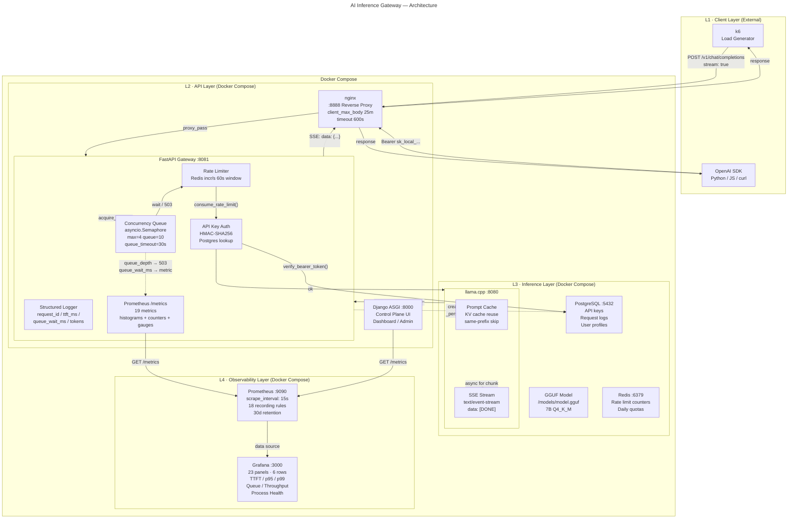
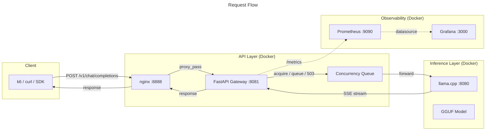

# Architecture Diagram Specification

## Overview

Four-layer inference gateway platform. Clients send OpenAI-compatible chat
completion requests through an nginx reverse proxy into a FastAPI gateway,
which manages concurrency, authentication, and metrics before proxying to
llama.cpp. Prometheus scrapes the gateway for inference metrics; Grafana
visualizes them in real-time.

---

## Layer Map

```
 ┌─────────────────────────────────────────────────────────────────────┐
 │  L1  CLIENT LAYER          k6 │ curl │ OpenAI SDK                    │
 │       (external)                                                     │
 ├─────────────────────────────────────────────────────────────────────┤
 │  L2  API LAYER              nginx :8888 │ FastAPI Gateway :8081      │
 │       (Docker compose)      ┌──────────────────────────────────┐    │
 │                             │  Concurrency Queue                │    │
 │                             │  Rate Limiter (Redis)             │    │
 │                             │  API Key Auth (Postgres)          │    │
 │                             │  Structured Logging               │    │
 │                             │  Prometheus /metrics              │    │
 │                             └──────────────────────────────────┘    │
 │                             Django Control Plane :8000              │
 ├─────────────────────────────────────────────────────────────────────┤
 │  L3  INFERENCE LAYER       llama.cpp :8080 │ GGUF Model             │
 │       (Docker compose)      ┌──────────────────────────────────┐    │
 │                             │  Prompt Cache (reuse)            │    │
 │                             │  SSE Token Stream                │    │
 │                             └──────────────────────────────────┘    │
 │                             Redis :6379 │ PostgreSQL :5432          │
 ├─────────────────────────────────────────────────────────────────────┤
 │  L4  OBSERVABILITY LAYER   Prometheus :9090 │ Grafana :3000         │
 │       (Docker compose)      ┌──────────────────────────────────┐    │
 │                             │  23-panel dashboard              │    │
 │                             │  18 recording rules              │    │
 │                             └──────────────────────────────────┘    │
 └─────────────────────────────────────────────────────────────────────┘
```

---

## Mermaid Diagram (Detailed)



---

## Mermaid Diagram (Simplified — for README)



---

## Excalidraw Layout Recommendations

### Canvas Settings
- **Dimensions**: 1400 × 1000 px
- **Background**: White (#ffffff) for GitHub; Dark (#1e1e1e) for LinkedIn
- **Grid**: Disabled
- **Export**: PNG at 2× resolution for retina displays

### Layer Layout (Vertical Stack)

```
y=0    ┌──────────────────────────────────────────────────────────┐
       │ L1 — Client Layer                    height: 120px       │
       │ [k6 box]  [OpenAI SDK box]                               │
y=120  ────────────────────────────────────────────────────────────
       │ L2 — API Layer                         height: 340px     │
       │ [nginx] ──→ [FastAPI Gateway]                             │
       │                ├─ [Concurrency Queue]                     │
       │                ├─ [Rate Limiter]                          │
       │                ├─ [API Key Auth]                          │
       │                └─ [Metrics]                               │
       │ [Django Control Plane]                                    │
y=460  ────────────────────────────────────────────────────────────
       │ L3 — Inference Layer                   height: 200px     │
       │ [llama.cpp] ── [GGUF Model]                               │
       │ [Redis]  [PostgreSQL]                                     │
y=660  ────────────────────────────────────────────────────────────
       │ L4 — Observability Layer               height: 160px     │
       │ [Prometheus] ──→ [Grafana]                                │
y=820  └──────────────────────────────────────────────────────────┘
```

### Container Boxes (Excalidraw "frames")
Use dashed rectangles with light fill for Docker Compose boundary:

| Container | x | y | w | h | Fill | Stroke |
|---|---|---|---|---|---|---|
| L1 Client Layer | 20 | 10 | 1360 | 110 | #f8f9fa | #adb5bd |
| L2 API Layer | 20 | 130 | 1360 | 320 | #e3f2fd | #1976d2 |
| L3 Inference Layer | 20 | 460 | 1360 | 190 | #f3e5f5 | #7b1fa2 |
| L4 Observability Layer | 20 | 660 | 1360 | 150 | #e8f5e9 | #388e3c |
| Docker Compose (wrap L2+L3+L4) | 10 | 120 | 1380 | 700 | none | #ff6f00 dashed |

### Component Boxes (rounded rectangles)

| Component | Layer | x | y | w | h | Notes |
|---|---|---|---|---|---|---|
| k6 | L1 | 60 | 40 | 140 | 50 | "k6 Load Generator" |
| OpenAI SDK | L1 | 280 | 40 | 180 | 50 | "curl / OpenAI SDK" |
| nginx | L2 | 60 | 170 | 140 | 50 | "nginx :8888" |
| FastAPI Gateway | L2 | 300 | 160 | 220 | 70 | "FastAPI Gateway :8081" |
| Concurrency Queue | L2 | 340 | 250 | 160 | 40 | sub-box inside Gateway |
| Rate Limiter | L2 | 340 | 295 | 160 | 40 | sub-box inside Gateway |
| API Key Auth | L2 | 340 | 340 | 160 | 40 | sub-box inside Gateway |
| Django | L2 | 60 | 360 | 140 | 50 | "Django ASGI :8000" |
| llama.cpp | L3 | 60 | 500 | 180 | 60 | "llama.cpp :8080" |
| GGUF Model | L3 | 320 | 505 | 160 | 50 | "GGUF 7B Q4_K_M" |
| Redis | L3 | 60 | 580 | 140 | 40 | "Redis :6379" |
| PostgreSQL | L3 | 320 | 580 | 160 | 40 | "PostgreSQL :5432" |
| Prometheus | L4 | 60 | 700 | 180 | 50 | "Prometheus :9090" |
| Grafana | L4 | 320 | 700 | 160 | 50 | "Grafana :3000" |

### Arrows

| From | To | Style | Label | Color |
|---|---|---|---|---|
| k6 | nginx | solid → | `POST /v1/...` | #1976d2 |
| SDK | nginx | solid → | `Bearer sk_...` | #1976d2 |
| nginx | Gateway | solid → | `proxy_pass` | #1976d2 |
| Gateway | llama.cpp | solid → | `stream: true` | #1976d2 |
| llama.cpp | Gateway | solid ← | `SSE data: {...}` | #2e7d32 |
| Gateway | nginx | solid ← | `SSE response` | #2e7d32 |
| nginx | k6 | solid ← | `200 OK` | #2e7d32 |
| nginx | SDK | solid ← | `200 OK` | #2e7d32 |
| Gateway | PostgreSQL | dashed → | `verify / persist` | #7b1fa2 |
| Gateway | Redis | dashed → | `incr rate limit` | #7b1fa2 |
| Gateway | Prometheus | dashed → | `GET /metrics` | #388e3c |
| Django | Prometheus | dashed → | `GET /metrics` | #388e3c |
| Prometheus | Grafana | dashed → | `datasource` | #388e3c |
| Concurrency Queue | (self) | curved label | `acquire / queue / 503` | #e65100 |

### Typography
- **Layer headers**: 14px bold, uppercase, #495057
- **Component titles**: 13px bold, #212529
- **Labels**: 11px normal, #495057
- **Arrow labels**: 10px italic, #1976d2
- **Font**: Inter or system-ui throughout

---

## Component Annotations

### L1 — Client Layer

| Component | Role | Details |
|---|---|---|
| **k6** | Load testing | 7 scripts: streaming, non-streaming, mixed, cancellation, timeout, spike, soak. Measures TTFT, latency, chunk count, error rate. |
| **OpenAI SDK / curl** | Production clients | Sends `POST /v1/chat/completions` with `Authorization: Bearer sk_local_...`. Supports `stream: true/false`. |

### L2 — API Layer

| Component | Role | Details |
|---|---|---|
| **nginx** | Edge proxy | Listens on `:8888`. Routes `/v1/*` to gateway, everything else to Django. `proxy_buffering off` for SSE. `client_max_body_size 25m`. Timeout 600s. |
| **FastAPI Gateway** | Inference API | Single-worker ASGI. OpenAI-compatible `/v1/chat/completions` + `/v1/models`. SSE streaming via async generator. All inference metrics instrumented here. |
| **Concurrency Queue** | Backpressure | `asyncio.Semaphore(4)` + queue(10). `acquire_slot()` returns wait_time or None (503). Queue depth tracked via `_queue_count` int. |
| **Rate Limiter** | RPM control | Redis `incr` with 60s sliding window. Per-key RPM limit. Fail-open on Redis outage. |
| **API Key Auth** | Security | HMAC-SHA256 with server pepper. Timing-safe comparison. Format: `sk_local_{public_id}_{secret}`. |
| **Structured Logger** | Observability | JSON-structured `request_complete` events with `request_id`, `ttft_ms`, `queue_wait_ms`, `tokens_per_sec`, `stream_duration_ms`, `error_kind`. |
| **Prometheus /metrics** | Metrics endpoint | 19 metrics: counters (requests, errors, tokens), histograms (TTFT, queue_wait, upstream_wall, stream_duration), gauges (active, queue_depth, in_flight). |
| **Django ASGI** | Control plane | Django dashboard, API key management, admin UI. Session + CSRF auth. NOT in the inference hot path — programmatic traffic routes to gateway. |

### L3 — Inference Layer

| Component | Role | Details |
|---|---|---|
| **llama.cpp** | LLM runtime | `llama-server` exposing OpenAI-compatible HTTP API. Multi-arch build (ARM + x86). Thread auto-detection (`nproc - 1`). 4096 context. |
| **GGUF Model** | Model weights | Single GGUF file mounted at `/models/model.gguf`. 7B Q4_K_M quantized. Read-only mount. |
| **Prompt Cache** | Performance | llama.cpp reuses KV cache for identical prompt prefixes. Dramatically reduces TTFT for repeated system prompts. |
| **SSE Stream** | Transport | `text/event-stream` with `data: {delta}` chunks and `data: [DONE]` terminator. |
| **Redis** | State store | Rate limit counters (`rl:rpm:{key_id}:{window}`). Daily quota counters. Optional: distributed semaphore for multi-worker. |
| **PostgreSQL** | Primary DB | API keys (hashed secrets, rate limits, usage counters). Inference request logs (100-char redacted previews). User profiles and quotas. |

### L4 — Observability Layer

| Component | Role | Details |
|---|---|---|
| **Prometheus** | Metrics store | Scrapes gateway (`:8081`) and Django (`:8000`) every 15s. 18 recording rules precompute p50/p95/p99 latency, token throughput, queue saturation, error ratio, process health. 30-day retention. |
| **Grafana** | Dashboard | 23 panels across 6 rows. Stat row: Active Requests, Queue Depth, Overload Rejections, Request Rate, Error Rate, Upstream Timeouts. Timeseries: TTFT p50/p95/p99, Upstream Latency, Queue Wait, Token Throughput, Streaming Duration, Error by Kind, Request by Mode, Streams In-Flight, Validation Rate, Rate Limit Hits, Process Health, Gateway Health, Overload & Timeouts. Heatmap: TTFT distribution. |

---

## Data Flow Walkthrough

### Normal Streaming Request

```
k6 ──POST──→ nginx ──proxy_pass──→ FastAPI Gateway
                                       │
                          ┌────────────┤
                          │            │
                    Rate Limit    API Key Auth
                    (Redis)      (Postgres)
                          │            │
                          └─────┬──────┘
                                │
                          Concurrency Queue
                          acquire_slot()
                                │
                          llama.cpp
                          POST /v1/chat/completions
                                │
                          [prompt processing]
                          [KV cache lookup]
                                │
                          SSE stream ←──┐
                          (token by     │
                           token)       │
                                │        │
                          Gateway       │
                          yields chunks──┘
                                │
                          nginx
                          (no buffering)
                                │
                          k6
                          parses SSE events
                          ttft = first chunk
                          stream_duration = elapsed
```

### Queue Saturation (Backpressure)

```
Request #5 arrives ──→ all 4 slots busy
                        ──→ _queue_count++
                        ──→ await sem.acquire()
                        ──→ queue_depth gauge = 1

Request #6..15 ──→ queue_depth = 2..10

Request #16 ──→ _queue_count > 10
                ──→ 503 overload_error
                ──→ rejected_overload counter++
```

### Client Disconnect

```
Client closes connection mid-stream
    │
FastAPI cancels StreamingResponse
    │
asyncio.CancelledError raised in event_stream()
    │
except CancelledError:
    status=499  err="client_disconnected"
    CHAT_COMPLETION_ERRORS.inc()
    raise
    │
finally:
    (nested finally guarantees release)
    release_concurrency_slot()
```

---

## Key Design Decisions (for diagram callouts)

| Decision | Rationale | Diagram Marker |
|---|---|---|
| Gateway single-worker ASGI | Semaphore-based concurrency requires single event loop | `★ single-worker` |
| Gateway proxies directly to llama.cpp | Django NOT in hot path; faster streaming, lower latency | `★ direct proxy` |
| `data: [DONE]` sentinel from upstream | Upstream llama.cpp sends it; gateway forwards transparently | `★ pass-through SSE` |
| Queue tracking via plain int | Atomic between await points in asyncio; no lock needed | `★ lock-free queue` |
| 503 (not 429) for overload | 503 = server capacity; 429 = client too fast | `★ 503 semantics` |
| Fail-open on Redis outage | Availability over strict rate enforcement | `★ fail-open` |

---

## Suggested Enhancements for Diagram

1. Add GPU badge to llama.cpp box for GPU-offload future
2. Add dotted-line "future" path for Redis distributed semaphore
3. Show `restart: unless-stopped` as a Docker badge
4. Annotate Prometheus scrape interval and rule count
5. Show 2x data: `[DONE]` path for healthy streams vs error SSE
6. Add `mem_limit` annotations (llamacpp: 48g, gateway: 2g, nginx: 256m)
