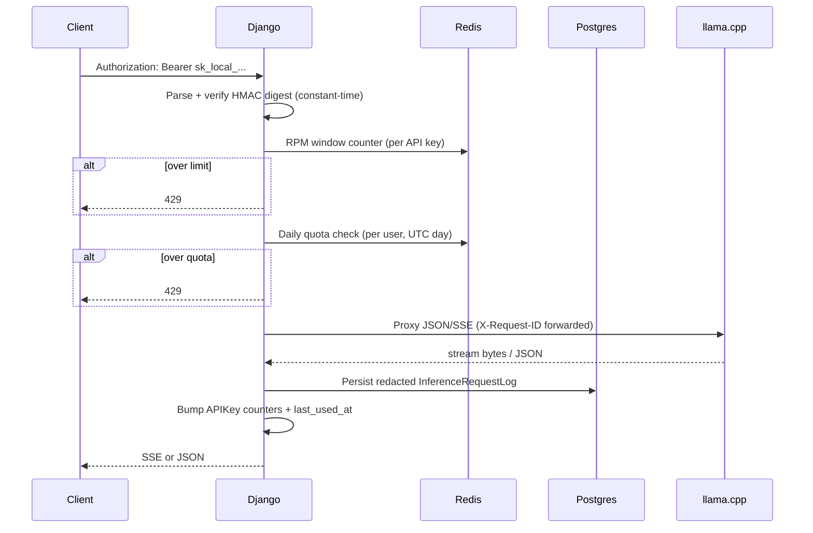

# Architecture — Phase 2 (control plane + observability)

This document is the living engineering record for the inference **control plane**. It complements `README.md` with diagrams, lifecycles, and explicit tradeoffs.

## System context

```mermaid
flowchart TB
  Client[Clients / scripts / dashboard] --> Edge[NGINX]
  Edge --> Django[Django ASGI (Uvicorn)]
  Django --> PG[(Postgres)]
  Django --> Redis[(Redis)]
  Django -->|OpenAI HTTP| Llama[llama.cpp server]
  Prom[Prometheus] -->|scrape /metrics| Django
  Graf[Grafana] --> Prom
```

## Request lifecycles

### Programmatic chat completion (`POST /v1/chat/completions`)



### Dashboard chat completion (`POST /ui/v1/chat/completions`)

Same orchestration path (`ChatCompletionService`), but authentication is **Django session + CSRF** instead of Bearer tokens. This avoids putting long-lived API secrets into browser storage while still allowing the same downstream proxying and logging.

## Streaming lifecycle (SSE over HTTP)

1. Django validates JSON into `ChatCompletionRequest`.
2. Django opens an **httpx async stream** to llama.cpp and begins forwarding **raw bytes** as `StreamingHttpResponse`.
3. A lightweight SSE parser counts **estimated completion tokens** and measures **TTFT** without re-serializing upstream frames to clients.
4. On **client disconnect**, cancellation propagates to async generators; upstream connections should be closed by httpx context managers.

**Tradeoff — SSE vs WebSockets**

- **SSE** matches OpenAI-compatible clients and is easy behind reverse proxies; **WebSockets** add connection upgrade complexity and different operational failure modes.
- SSE is **one-way**; if you need bidirectional control messages at high frequency, WebSockets may win — at the cost of more moving parts.

## Security model — API keys

### Why hashed keys (not plaintext)

- **Database leaks** should not instantly grant model access to the world.
- **Insider risk** is reduced: operators with DB read access still cannot exfiltrate usable secrets without also obtaining the **pepper** (`API_KEY_HMAC_PEPPER`, defaulting to `SECRET_KEY`).

**Operational tradeoffs**

- Fast verification uses **HMAC-SHA256** (not password hashing). If the pepper leaks, offline guessing becomes easier than Argon2-protected passwords — treat the pepper like a Tier-0 secret and rotate with a key rotation playbook.
- You **cannot** recover a lost key; you revoke and re-issue.

### Constant-time verification

On unknown `public_id`, the code still performs a `hmac.compare_digest` against a dummy digest to reduce timing oracle signal.

## Logging & privacy defaults

`InferenceRequestLog` stores **redacted previews** and aggregate sizing/token estimates — **not** full prompts by default.

`DEBUG_LOG_FULL_PROMPTS=true` is for **local debugging only** and still runs through basic redaction helpers.

### Why production systems often avoid full prompt retention

- **Privacy / compliance**: prompts are user data; retention expands blast radius for legal requests and insider misuse.
- **Security**: prompts frequently contain secrets (tokens, logs, PII).
- **Cost**: large TEXT columns bloat backups and slow incident response queries.

**Operational tradeoff**

- Debugging production incidents without prompts is harder — mitigate with **request IDs**, **metrics**, **sampling**, and **temporary elevated logging** behind break-glass processes.

## Observability

- **Correlation**: `RequestContextMiddleware` assigns/propagates `X-Request-ID` and binds it into JSON logs.
- **Metrics**: Prometheus counters/histograms for TTFT, streaming duration, rate limits, quotas, token estimates, and process RSS/CPU best-effort via `psutil`.
- **Readiness**: `/ready` includes DB; optional llama probe via `READINESS_INCLUDE_LLAMA`.

## Redis necessity

Redis (or another shared cache) is important for **horizontal scaling** of rate limits and quotas. LocMem works for single-process dev, but multi-worker / multi-replica deployments require a shared store or you will under/over-enforce limits.

## Django async limitations

- Async views mix cleanly with **thread-sensitive ORM** when wrapped in `sync_to_async(thread_sensitive=True)` for small, bounded operations (audit writes, usage counters).
- Heavy ORM inside hot streaming loops is an anti-pattern: keep the streaming path as **byte-forwarding** as possible.

## CPU inference bottlenecks

Django should remain cheap; throughput is dominated by **llama.cpp threading**, **quantization**, **context length**, and **batching** — not Python JSON parsing.

## Service boundaries (Phase 2)

- **`ChatCompletionService`**: policy orchestration + metrics + logging + streaming lifecycle.
- **`LlamaCppBackend`**: HTTP transport only.
- **`apps.api_keys.services.*`**: issuance, verification, audit, limits.
- **`apps.observability.*`**: redaction helpers, runtime gauges, health endpoints.

## Benchmarking preparation (next)

Histograms (`TTFT_SECONDS`, `STREAMING_DURATION_SECONDS`, `UPSTREAM_LATENCY_SECONDS`) plus token counters provide the raw series for PromQL dashboards (P50/P95) and offline bench harnesses.
