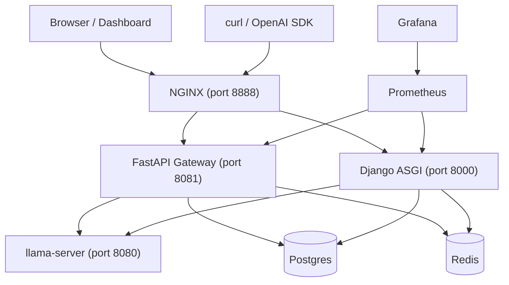
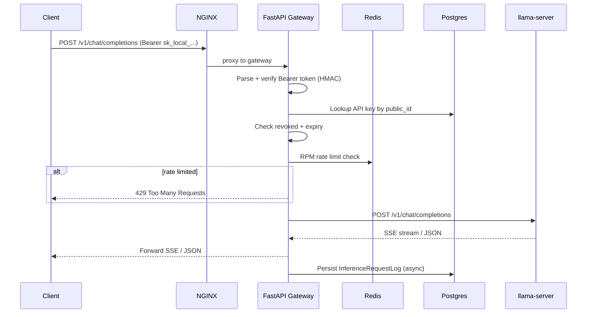
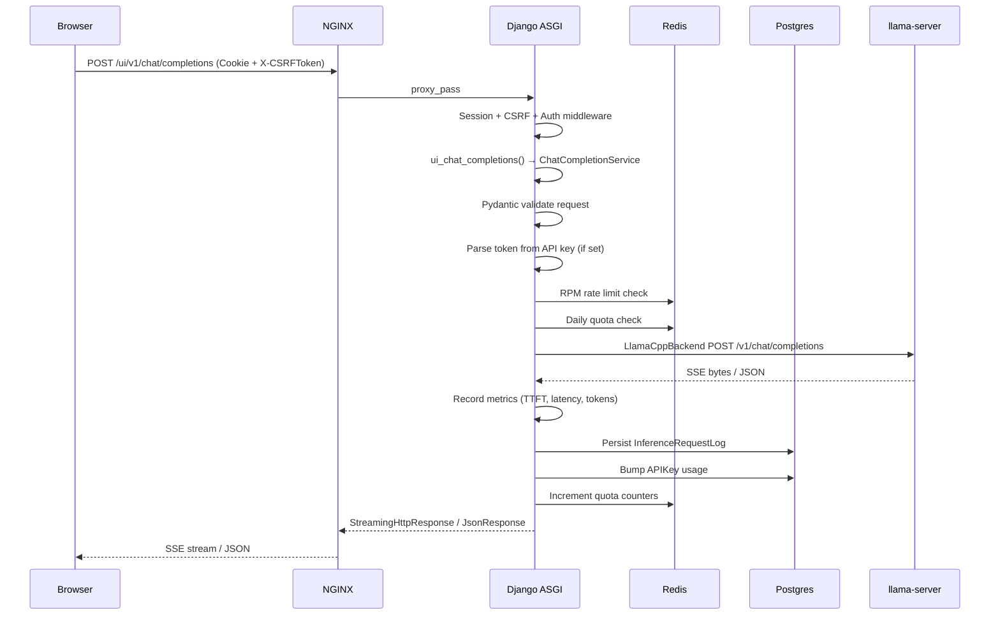
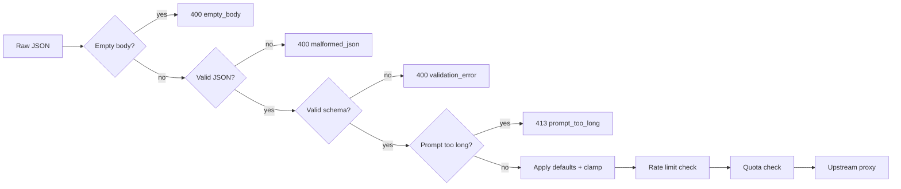

# Architecture — LLM Inference Control Plane

## System context



## Container topology

| Service | Image / Build | Ports | Purpose |
|---|---|---|---|
| **nginx** | `nginx:1.27-alpine` | `8888:80` | Edge proxy — routes `/v1/*` to gateway, everything else to Django |
| **django** | Local `Dockerfile` | `8000` (internal) | Control plane: dashboard UI, session auth, admin, observability |
| **gateway** | `deploy/gateway/Dockerfile` | `8081` (internal), `127.0.0.1:18081:8081` | Programmatic OpenAI API surface with API key auth + rate limiting |
| **llamacpp** | `deploy/llamacpp/Dockerfile` | `8080` (internal) | Model inference — `llama-server` exposing OpenAI-compatible HTTP API |
| **postgres** | `postgres:16-alpine` | `5432` (internal) | Primary database: Django models, gateway audit logs |
| **redis** | `redis:7-alpine` | `6379` (internal) | Rate limiting, daily quotas, caching |
| **prometheus** | `prom/prometheus:v2.53.0` | `9090:9090` | Metrics collection from Django + gateway |
| **grafana** | `grafana/grafana:11.2.0` | `3000:3000` | Dashboard visualization (default: `admin`/`admin`) |

## Request lifecycles

### Programmatic path (`POST /v1/chat/completions`)



### Dashboard UI path (`POST /ui/v1/chat/completions`)



## Django internals

### URL routing (root: `config/urls.py`)

| Path | Target | Notes |
|---|---|---|
| `/accounts/login/` | `django.contrib.auth.views.LoginView` | Template: `registration/login.html` |
| `/accounts/logout/` | `django.contrib.auth.views.LogoutView` | POST-only |
| `/admin/` | Django admin | |
| `/health/live` | `observability.views.live_view` | Always returns `{"status": "live"}` |
| `/health/ready` | `observability.views.ready_view` | DB check + optional llama health |
| `/health` | `live_view` (alias) | |
| `/ready` | `ready_view` (alias) | |
| `/metrics` | `observability.views.metrics_view` | Prometheus scrape endpoint |
| `/internal/model-status` | `observability.views.model_status_view` | LLM runtime health |
| `/ui/v1/` | `inference.ui_urls` | Session-authenticated inference |
| `/` | `dashboard.urls` | Home, chat, API key management |

### Middleware stack (in order)

| # | Middleware | Responsibility |
|---|---|---|
| 1 | `SecurityMiddleware` | HSTS, SSL redirect, secure headers |
| 2 | `RequestContextMiddleware` | Assigns/propagates `X-Request-ID`, binds to `contextvars` |
| 3 | `WhiteNoiseMiddleware` | Serves static files from `STATIC_ROOT` |
| 4 | `CorsMiddleware` | CORS headers for allowed origins |
| 5 | `SessionMiddleware` | Session management via DB or Redis |
| 6 | `CommonMiddleware` | URL normalization, `APPEND_SLASH` |
| 7 | `CsrfViewMiddleware` | CSRF token validation for session-based UI |
| 8 | `AuthenticationMiddleware` | Attaches `request.user` from session |
| 9 | `MessageMiddleware` | Django messages framework |
| 10 | `XFrameOptionsMiddleware` | Clickjacking protection |
| 11 | `BodySizeLimitMiddleware` | Rejects bodies > 2MB (configurable) |
| 12 | `SecurityHeadersMiddleware` | Adds `X-Content-Type-Options`, `Referrer-Policy`, `Permissions-Policy` |

### Dashboard views (`apps/dashboard`)

| URL | View | Auth | Template |
|---|---|---|---|
| `/` | `HomeView` | `LoginRequiredMixin` | `dashboard/home.html` |
| `/chat/` | `ChatView` | `LoginRequiredMixin`, `@ensure_csrf_cookie` | `dashboard/chat.html` |
| `/staff/api-keys/` | `StaffAPIKeyCreateView` | `LoginRequiredMixin` + `is_staff` | `dashboard/api_keys_create.html` |
| `/staff/api-keys/reveal/` | `StaffAPIKeyRevealView` | `LoginRequiredMixin` + `is_staff` | `dashboard/api_keys_reveal.html` |

## FastAPI Gateway (`deploy/gateway`)

### Routes

| Method | Path | Auth | Description |
|---|---|---|---|
| GET | `/health` | No | Liveness probe |
| GET | `/ready` | No | DB + llama readiness |
| GET | `/metrics` | No | Prometheus metrics |
| POST | `/v1/chat/completions` | Bearer token | Chat completion (streaming + non-streaming) |
| GET | `/v1/models` | Bearer token | List models from llama.cpp |

### Auth flow

1. Extract `Bearer` token from `Authorization` header
2. Parse with regex `^sk_local_([a-f0-9]{12})_([a-f0-9]{64})$`
3. Lookup `APIKey` by `public_id` in Postgres (via `asyncpg`)
4. HMAC-SHA256 comparison (constant-time) against stored hash with server pepper
5. Verify `revoked_at IS NULL` and `expires_at` not past
6. Return `APIKeyContext(id, user_id, rate_limit_rpm)`

### Rate limiting

- Fixed 1-minute window via `redis.incr`
- Key: `rl:rpm:{api_key_id}:{timestamp // 60}`
- TTL: 120s on first increment
- Gateway returns 429 if exceeded

### Concurrency control

All programmatic API requests pass through a per-process `asyncio.Semaphore`
before reaching llama.cpp. This prevents upstream overload and provides
graceful degradation:

1. **Acquire slot** — `concurrency.acquire_slot()` attempts to acquire the
   semaphore. If all slots are busy, the request is enqueued (up to
   `inference_queue_size`, default 10).
2. **Queue timeout** — if a slot doesn't become available within
   `inference_queue_timeout_s` (default 30s), returns 503.
3. **Overload rejection** — if the queue is full, returns 503 immediately.
4. **Release slot** — `concurrency.release_slot()` is called in the `finally`
   block of every streaming generator and non-streaming handler.

Queue depth is tracked via a module-level `_queue_count` integer and exposed
through the `inference_queue_depth` Prometheus Gauge.

### Metrics inventory

All inference metrics are registered on both the gateway and Django. The
gateway is the primary source for API traffic metrics since requests flow
`k6 → nginx → gateway → llamacpp` (Django is not in the hot path).

| Metric | Type | Labels | Instrumented in Gateway |
|---|---|---|---|
| `inference_chat_requests_total` | Counter | `mode` | Yes |
| `inference_chat_completions_streaming_total` | Counter | — | Yes |
| `inference_chat_completions_nonstreaming_total` | Counter | — | Yes |
| `inference_active_requests` | Gauge | `mode` | Yes |
| `inference_validation_errors_total` | Counter | `kind` | No (handled by Django UI path) |
| `inference_rejected_requests_total` | Counter | `reason` | No (handled by Django UI path) |
| `inference_queue_depth` | Gauge | — | Yes (via `_queue_count`) |
| `inference_queue_wait_seconds` | Histogram | — | Yes |
| `inference_rejected_overload_total` | Counter | — | Yes |
| `inference_clamped_requests_total` | Counter | `field` | No (Django UI path) |
| `inference_max_tokens_requested` | Histogram | — | No (Django UI path) |
| `inference_chat_completions_errors_total` | Counter | `kind` | Yes |
| `inference_upstream_timeouts_total` | Counter | — | Yes |
| `inference_upstream_wall_seconds` | Histogram | — | Yes |
| `inference_streaming_requests_in_flight` | Gauge | — | Yes |
| `inference_rate_limit_exceeded_total` | Counter | — | Yes |
| `inference_quota_exceeded_total` | Counter | — | No (Django UI path) |
| `inference_time_to_first_token_seconds` | Histogram | — | Yes |
| `inference_streaming_duration_seconds` | Histogram | — | Yes |
| `inference_tokens_total` | Counter | `kind` | Yes |
| `gateway_process_uptime_seconds` | Gauge | — | Yes |
| `gateway_process_resident_memory_bytes` | Gauge | — | Yes |
| `gateway_process_cpu_percent` | Gauge | — | Yes |

### Gateway Prometheus recording rules

The Prometheus rules file (`deploy/prometheus/rules.yml`) defines 18 recording
rules for the gateway's inference metrics:

| Rule | Source | Description |
|---|---|---|
| `inference:request_rate:rate5m` | `inference_chat_requests_total` | Request rate (last 5m) |
| `inference:error_rate:rate5m` | `inference_chat_completions_errors_total` | Error rate (last 5m) |
| `inference:error_ratio:rate5m` | errors / requests | Error ratio (last 5m) |
| `inference:upstream_latency:p50` | `inference_upstream_wall_seconds` | p50 upstream latency |
| `inference:upstream_latency:p95` | same | p95 upstream latency |
| `inference:upstream_latency:p99` | same | p99 upstream latency |
| `inference:ttft:p50` | `inference_time_to_first_token_seconds` | p50 TTFT |
| `inference:ttft:p95` | same | p95 TTFT |
| `inference:ttft:p99` | same | p99 TTFT |
| `inference:stream_duration:p50` | `inference_streaming_duration_seconds` | p50 stream duration |
| `inference:stream_duration:p95` | same | p95 stream duration |
| `inference:token_throughput:rate5m` | `inference_tokens_total` | Token throughput (last 5m) |
| `inference:queue_wait:p50` | `inference_queue_wait_seconds` | p50 queue wait time |
| `inference:queue_wait:p95` | same | p95 queue wait time |
| `inference:queue_saturation:ratio` | `inference_queue_depth / 10` | Queue saturation (0–1) |
| `inference:active_requests:max5m` | `inference_active_requests` | Max active requests (last 5m) |
| `inference:overload_rate:rate5m` | `inference_rejected_overload_total` | Overload rejection rate |

## Inference service (`apps/inference`)

### `ChatCompletionService` orchestration

1. **Parse & validate** — `ChatCompletionRequest.model_validate_json(raw_body)` (Pydantic)
2. **Rate limit** — `consume_rate_limit(api_key)` via Redis/LocMem
3. **Daily quota** — `check_user_daily_quota(user, ptok_est, completion_budget)` from `UserProfile` settings
4. **Concurrency slot** — `acquire()` from `apps/inference/services/concurrency.py`; returns 503 if queue is full
5. **Proxy upstream** — `LlamaCppBackend.stream_chat_completion()` or `.chat_completion()`
6. **Record metrics** — TTFT, latency, tokens, errors (Prometheus)
7. **Persist log** — `InferenceRequestLog` (async DB write)
8. **Post hooks** — `record_user_quota_success()`, `bump_api_key_usage()`
9. **Release slot** — `release()` in the `finally` block of the streaming generator or non-streaming handler

### `LlamaCppBackend`

- HTTP transport only — never loads GGUF weights
- `stream_chat_completion()` — yields SSE bytes via `httpx.AsyncClient.stream()`
- `chat_completion()` — buffered POST with 1 retry
- `list_models()` — GET `/v1/models`
- Target: `LLAMA_CPP_BASE_URL/v1/chat/completions` (default: `http://llamacpp:8080`)
- Connection pool: 100 max connections, 20 keepalive, 600s read timeout

### Pydantic schemas

```python
class ChatCompletionRequest(BaseModel):
    model: str = "default"          # min_length=1, max_length=256
    messages: list[ChatMessage]     # min_length=1
    stream: bool = False
    temperature: float | None       # 0.0–2.0
    top_p: float | None             # 0.0–1.0
    max_tokens: int | None          # 1–1,000,000
    stop: str | list[str] | None
    presence_penalty: float | None  # -2.0–2.0
    frequency_penalty: float | None # -2.0–2.0
    user: str | None
```

## Data models

### `UserProfile` (`apps/users`)

| Field | Type | Description |
|---|---|---|
| `user` | `OneToOneField(User)` | Django auth user |
| `daily_request_limit` | `PositiveIntegerField(null)` | Max requests per UTC day |
| `daily_token_limit` | `PositiveIntegerField(null)` | Max tokens per UTC day |
| `default_api_key` | `ForeignKey(APIKey, null)` | Optional default key for UI path |

Auto-created via `post_save` signal when any `User` is created.

### `APIKey` (`apps/api_keys`)

| Field | Type | Description |
|---|---|---|
| `id` | `UUIDField` (PK) | |
| `user` | `ForeignKey(User)` | Key owner |
| `public_id` | `CharField(16, unique)` | Public identifier, e.g. `a1b2c3d4e5f6` |
| `secret_hash` | `CharField(128)` | HMAC-SHA256 hex digest |
| `label` | `CharField(64)` | Human-readable name |
| `rate_limit_rpm` | `PositiveIntegerField(default=120)` | Max requests per minute |
| `requests_count` | `BigIntegerField(default=0)` | Lifetime request counter |
| `prompt_tokens_total` | `BigIntegerField(default=0)` | Lifetime prompt tokens |
| `completion_tokens_total` | `BigIntegerField(default=0)` | Lifetime completion tokens |

Format: `sk_local_{public_id}_{secret_component}` (12 hex + 64 hex = 128-bit + 256-bit entropy)

### `InferenceRequestLog` (`apps/inference`)

| Field | Type | Notes |
|---|---|---|
| `id` | `UUIDField` (PK) | |
| `request_id` | `UUIDField` | Correlates across services |
| `user` | `ForeignKey(User, null)` | |
| `api_key` | `ForeignKey(APIKey, null)` | |
| `model_name` | `CharField(256)` | |
| `stream` | `BooleanField` | |
| `status_code` | `IntegerField` | |
| `latency_ms` | `IntegerField` | |
| `prompt_char_length` | `IntegerField` | |
| `completion_tokens` | `IntegerField` | |
| `preview` | `TextField` | Redacted, 100 chars max |
| `full_prompt` | `TextField(null)` | Only when `DEBUG_LOG_FULL_PROMPTS=true` |
| `error_kind` | `CharField(64, blank)` | |

## Generation controls

Server-side defaults are applied when the client omits a parameter. If the client
passes a value exceeding the hard cap, it is **clamped silently**.

| Parameter | Default | Hard cap | Configurable via |
|---|---|---|---|
| `max_tokens` | 128 | 512 | `INFERENCE_DEFAULT_MAX_TOKENS`, `INFERENCE_HARD_MAX_TOKENS` |
| `temperature` | 0.7 | [0.0, 2.0] | `INFERENCE_DEFAULT_TEMPERATURE` |
| `top_p` | 0.9 | [0.0, 1.0] | `INFERENCE_DEFAULT_TOP_P` |

Clamping is tracked via the `inference_clamped_requests_total` metric with a
`field` label (`max_tokens`, `temperature`, `top_p`).

## Request validation flow



Each rejection path records a structured log with `request_id`, `error_kind`,
and the appropriate `inference_validation_errors_total` or
`inference_rejected_requests_total` metric.

## Timeout handling

- Upstream requests use the httpx read timeout configured in `http_client.py`
  (default: 600s, configurable via `INFERENCE_UPSTREAM_TIMEOUT_S`).
- `httpx.ReadTimeout` is caught and converted to `UpstreamTimeoutError`.
- Non-streaming: returns HTTP 504 with `{"error": {"message": "Upstream inference timed out", "type": "api_error"}}`.
- Streaming: yields an SSE error chunk and closes the stream gracefully.
- Timeouts are counted via `inference_upstream_timeouts_total`.

## Prometheus metrics inventory

### Django (`/metrics`)

| Metric | Type | Labels | Description |
|---|---|---|---|
| `inference_chat_requests_total` | Counter | `mode` | Requests entering handler |
| `inference_chat_completions_streaming_total` | Counter | — | Streaming requests |
| `inference_chat_completions_nonstreaming_total` | Counter | — | Non-streaming requests |
| `inference_active_requests` | Gauge | `mode` | Currently active requests (in-flight) |
| `inference_validation_errors_total` | Counter | `kind` | Validation failures by type |
| `inference_rejected_requests_total` | Counter | `reason` | Rejected by policy (e.g. prompt_too_long) |
| `inference_queue_depth` | Gauge | — | Number of requests waiting for a concurrency slot |
| `inference_queue_wait_seconds` | Histogram | — | Time spent queued before inference starts |
| `inference_rejected_overload_total` | Counter | — | Requests rejected because the queue was full (503) |
| `inference_clamped_requests_total` | Counter | `field` | Parameters clamped to server limits |
| `inference_max_tokens_requested` | Histogram | — | Distribution of requested max_tokens |
| `inference_chat_completions_errors_total` | Counter | `kind` | Error count by type |
| `inference_upstream_timeouts_total` | Counter | — | Upstream timeout count |
| `inference_upstream_wall_seconds` | Histogram | — | Wall time waiting on llama.cpp |
| `inference_streaming_requests_in_flight` | Gauge | — | Active streaming sessions |
| `inference_rate_limit_exceeded_total` | Counter | — | RPM limit hits |
| `inference_quota_exceeded_total` | Counter | — | Daily quota hits |
| `inference_time_to_first_token_seconds` | Histogram | — | TTFT (streaming) or full response (non-streaming) |
| `inference_streaming_duration_seconds` | Histogram | — | Streaming session wall clock |
| `inference_tokens_total` | Counter | `kind` | Estimated completion tokens |
| `django_process_uptime_seconds` | Gauge | — | Process uptime |
| `django_process_resident_memory_bytes` | Gauge | — | RSS (via psutil) |
| `django_process_cpu_percent` | Gauge | — | CPU% (via psutil) |

### FastAPI Gateway (`/metrics`)

| Metric | Type | Labels | Description |
|---|---|---|---|
| `gateway_http_requests_total` | Counter | `route`, `status` | Request count by route and status |
| `gateway_upstream_seconds` | Histogram | — | Upstream request duration |
| `gateway_stream_bytes_total` | Counter | — | Bytes streamed to client |

## llama.cpp container

### Startup sequence (`deploy/llamacpp/entrypoint.sh`)

1. **Architecture probe** — logs `uname -m` for ARM vs x86 debugging
2. **Thread auto-detection** — if `NUM_THREADS=auto`, sets to `nproc - 1`
3. **Model validation** — checks file exists and validates GGUF magic bytes (`0x47475546`)
4. **Exec `llama-server`** as PID 1:
   ```sh
   llama-server --jinja \
     --model $MODEL_PATH \
     --host $HOST --port $PORT \
     --ctx-size $CONTEXT_SIZE \
     --threads $NUM_THREADS \
     $EXTRA_ARGS
   ```

### Model mounting

- Default: `/models/model.gguf` (configurable via `MODEL_PATH`)
- Mounted read-only from host `./models/` directory
- The `model` field in API requests is cosmetic metadata — the actual loaded model is always the single GGUF at `MODEL_PATH`

## Security model

### API key hashing

- Keys use format `sk_local_{public_id}_{secret}`
- `secret_hash` stored as HMAC-SHA256(pepper, raw_key)
- Pepper defaults to `SECRET_KEY`; should be a dedicated secret in production
- Unknown `public_id` still performs constant-time compare against a dummy hash (timing oracle mitigation)
- Keys can be revoked (soft-delete via `revoked_at`) or hard-deleted

### CSRF

- UI path uses Django session + CSRF token
- `CSRF_TRUSTED_ORIGINS` must include the ingress origin (e.g., `http://localhost:8888`)
- Programmatic path uses Bearer tokens routed through the FastAPI gateway (not Django)

### Observability

- Request IDs are propagated via `X-Request-ID` across all services
- JSON-structured logging with `request_id` field
- `InferenceRequestLog` stores redacted previews by default — full prompts only with `DEBUG_LOG_FULL_PROMPTS=true`
- `/metrics` considered sensitive; should be restricted by network policy in production

## Key design decisions

1. **Django never loads GGUF weights** — avoids RSS spikes in the web tier; Django and llama.cpp scale independently
2. **Separate Django ASGI and FastAPI gateway** — blast radius isolation; security patches can be rolled independently
3. **SSE over WebSockets** — matches OpenAI client ecosystem; simpler reverse proxy handling (no upgrade)
4. **"Forward bytes" streaming** — minimal SSE parsing in Python; throughput dominated by llama.cpp, not Django
5. **Pydantic at boundary, plain dict upstream** — strict validation at entry, pass-through to llama.cpp
6. **Redis optional locally** (`USE_REDIS=false`) — single-process dev works without Docker; production uses Redis
7. **Prometheus in-process** — lowest friction for startup-internal platforms; `/metrics` as standard pattern
8. **Static files via startup collectstatic** — bind-mounted host code means `collectstatic` runs at container start, not build time
9. **Clamp, don't reject** — generation parameters are clamped server-side rather than rejected, so slightly-over-limit requests still succeed. Hard policy limits (prompt size) still return 413.
10. **Early prompt validation** — prompt size is checked before defaults are applied, rate limits checked, or upstream calls made. This avoids wasting work on requests that will be rejected.
11. **Structured error taxonomy** — each rejection has a unique `error_kind` string that maps 1:1 to a metric label, enabling precise error rate dashboards without high-cardinality labels.
12. **Timeout as distinct error class** — `UpstreamTimeoutError` is separate from `UpstreamUnavailableError` so timeouts can be tracked independently. This matters for debug: timeouts suggest tuning timeout settings or model speed, while unavailability suggests infrastructure issues.
13. **Per-process asyncio.Semaphore for concurrency** — Django runs single-worker by default, so a process-local semaphore is sufficient. The semaphore (as opposed to `asyncio.Queue`) keeps overhead minimal — acquire/release are O(1). Queue depth is tracked via a Prometheus Gauge, not a data structure. If multi-worker is needed, this must be replaced with a Redis-based distributed semaphore.
14. **503 (not 429) for overload** — 429 implies the client sent too many requests and should back off (rate limiting). 503 signals server-side capacity exhaustion — the client may retry later. This matches both HTTP semantics and the operational action required (scale up or reduce concurrency). The response body is structured JSON compatible with OpenAI error format.
