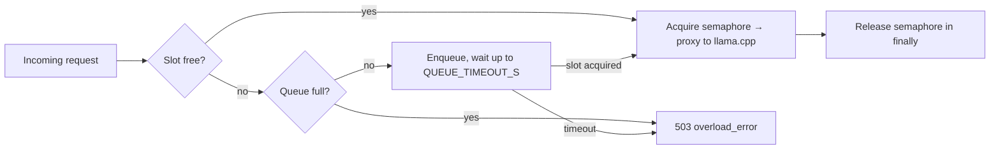

# Performance Guide

## Concurrency model

Inference requests pass through a per-process `asyncio.Semaphore` in the
**FastAPI gateway** before reaching llama.cpp. This prevents upstream
oversubscription and provides graceful degradation under load.

### Gateway configuration

The gateway uses its own Settings class (`deploy/gateway/gateway/config.py`):

| Variable | Default | Description |
|---|---|---|
| `inference_max_concurrency` | 4 | Max simultaneous upstream requests per gateway process |
| `inference_queue_size` | 10 | Max requests waiting for a slot before 503 |
| `inference_queue_timeout_s` | 30.0 | How long a queued request waits before 503 |

### Backpressure flow



### Key metrics

| Metric | What it measures | Action if elevated |
|---|---|---|
| `inference_queue_depth` | Requests waiting for a slot | Increase `inference_max_concurrency` or scale workers |
| `inference_queue_wait_seconds` | How long requests wait in queue | Check llama.cpp throughput; reduce prompt sizes |
| `inference_rejected_overload_total` | Requests returned 503 | Increase capacity or rate-limit clients |
| `inference_active_requests` | Currently in-flight upstream calls | Compare against `inference_max_concurrency` |

## Bottlenecks

| Tier | Bottleneck | Symptom | Mitigation |
|---|---|---|---|
| **llama.cpp** | CPU-bound context processing | High `upstream_wall_seconds`, low tokens/sec | Smaller quantized model, fewer threads, shorter context |
| **FastAPI Gateway** | Event loop saturation | Elevated `queue_wait_seconds`, 503 spikes | Raise `inference_max_concurrency`, add uvicorn workers |
| **httpx pool** | Connection pool exhaustion | `UpstreamUnavailableError` with connection timeouts | Increase `max_connections` in `http_client.py` |
| **Postgres** | Log persistence I/O | Slow `persist_inference_request_log` (async) | Increase `LOG_RETENTION_DAYS` or tune checkpoint intervals |
| **Redis** | Rate limit / quota key banging | Elevated Redis latency | Reduce `RATE_LIMIT_RPM` checks, use pipeline |

## Throughput guidance

These numbers assume a single gateway worker and a typical 7B-parameter Q4_K_M
model on a modern CPU (M-series or Xeon with AVX2). Your results will vary.

| Scenario | Max concurrency | Observed throughput | Bottleneck |
|---|---|---|---|
| Short prompts (50 chars), short replies (32 tokens) | 4 | ~2-4 req/s | llama.cpp |
| Medium prompts (500 chars), medium replies (128 tokens) | 4 | ~0.5-1 req/s | llama.cpp |
| Long prompts (5000 chars), long replies (512 tokens) | 2 | ~0.1-0.3 req/s | llama.cpp |
| Streaming, short TTFT | 4 | TTFT p50 ~1-3s | llama.cpp prompt processing |

The concurrency limiter prevents tail-latency collapse: when llama.cpp is saturated,
new requests queue or get 503 instead of timing out after 600s.

## Tuning guidelines

### When to increase `inference_max_concurrency`

- `inference_active_requests` is consistently at the current limit
- `inference_queue_depth` is non-zero for sustained periods
- llama.cpp has headroom (not at 100% CPU, not OOM)

### When to decrease `inference_max_concurrency`

- llama.cpp CPU is saturated (>90% user time)
- `upstream_wall_seconds` p95 degrades as concurrency increases (thrashing)
- Gateway RSS grows under concurrent streaming (many SSE buffers in memory)

### When to increase `inference_queue_size`

- Brief bursts of traffic expected (spike pattern)
- Clients can tolerate 10-30s queuing delay

### When to decrease `inference_queue_timeout_s`

- Clients prefer fast 503 over waiting
- Interactive UI requests should queue briefly (<5s)

## Known ceiling: single-worker ASGI

With `--workers 1`, maximum throughput is bounded by:
1. llama.cpp token generation speed
2. FastAPI event loop not blocking on sync DB/Redis operations
3. httpx connection pool (default: 100 max connections)

If the concurrency limiter is the active bottleneck (queue depth > 0, rejected
overload > 0, but llama.cpp has headroom), consider:

- Increasing `inference_max_concurrency` conservatively
- Adding uvicorn workers (each gets its own semaphore — scale linearly, but
  llama.cpp becomes the bottleneck sooner)
- Replacing the per-process semaphore with a Redis-based distributed semaphore
  for coordinated limits across workers

## Stress testing analysis

### Expected saturation order

When load increases on a single-worker deployment, resources saturate in this
order:

1. **llama.cpp CPU** — token generation is CPU-bound. As concurrent requests
   increase, each request competes for CPU time, increasing TTFT and per-token
   latency. This is the true bottleneck in virtually all scenarios.
2. **Concurrency semaphore** — once `inference_max_concurrency` is reached,
   the queue fills. Upstream latency continues degrading as llama.cpp context
   switches between active sequences.
3. **Queue capacity** — with `inference_queue_size=10`, 10 requests can wait. Beyond
   that, new requests get 503. This is the _protection mechanism_ kicking in.
4. **FastAPI event loop** — if llama.cpp is fast enough (small models, GPU),
   the ASGI event loop can become saturated by the overhead of async iteration.
5. **httpx connection pool** — at 100 concurrent connections, the pool exhausts
   and new upstream connections queue internally.

### CPU-bound bottleneck (llama.cpp)

The platform is designed for CPU-bound inference (llama.cpp on metal without
GPU offload). Key implications:

- **Prompt processing** is the TTFT bottleneck: llama.cpp must compute the
  full prompt KV cache before generating the first token. A 2000-token prompt
  can take 5-15s on CPU before any output appears.
- **Token generation** is linear: each token requires an sequential forward
  pass. At ~5-20 tok/s (7B Q4_K_M), a 256-token response takes 15-50s.
- **Concurrent sequences** multiply context memory: each active sequence needs
  its own KV cache in RAM. With 4 concurrent slots at 4096 context, that's
  ~8-16GB of additional RSS.

The concurrency limiter exists primarily to prevent thrashing: when more
requests arrive than llama.cpp can handle, they queue instead of all running
slowly and timing out together.

### GPU-accelerated bottleneck (future)

If GPU offload is added (llama.cpp `--n-gpu-layers N`), the bottleneck shifts:

| Resource | CPU-bound | GPU-bound |
|---|---|---|
| Prompt processing | CPU (slow) | GPU (fast, batching helps) |
| Token generation | Memory bandwidth (CPU) | GPU compute/memory |
| Concurrent limit | 2-4 (CPU time) | 8-16+ (VRAM) |
| TTFT | Seconds | Milliseconds |
| Tokens/sec | 5-20 | 50-200+ |

With GPU, the bottleneck moves from llama.cpp to the gateway event loop
and httpx connection pool, since requests complete faster.

### Scaling tradeoffs

| Approach | Pros | Cons |
|---|---|---|
| **Increase workers** | Linear throughput scaling (per-worker) | Each worker duplicates semaphore; llama.cpp gets N× the concurrent load |
| **Distributed semaphore** (Redis) | Coordinated limit across workers | Redis dependency; latency overhead on every acquire/release |
| **Multiple llama.cpp instances** | True horizontal scaling | No built-in load balancing; requires reverse proxy |
| **GPU offload** | 10-50× TTFT improvement | VRAM limits; GPU memory fragmentation |
| **Smaller quantized model** | Higher tok/s, lower memory | Lower quality; may not fit use-case |

### Future optimizations

1. **Prompt caching** — cache KV cache between identical prompts (e.g., system
   messages). Would dramatically reduce TTFT for repeated prefixes.
2. **Continuous batching** — llama.cpp supports "parallel" mode that processes
   multiple sequences in a single forward pass, improving throughput at the
   cost of per-sequence latency.
3. **Speculative decoding** — use a small draft model to generate candidates,
   verified by the large model. Can 2-3× token throughput on CPU.
4. **Redis-based distributed semaphore** — replace the per-process
   `asyncio.Semaphore` with a Redis semaphore when multi-worker is needed.
5. **Adaptive concurrency** — dynamically adjust `inference_max_concurrency`
   based on observed upstream latency, to prevent thrashing under variable load.
6. **Preemption** — when a 503 is imminent, consider cancelling the
   longest-running streaming request instead (requires client retry support).

## Monitoring queries

All metrics should be queried from the Prometheus gateway job. The Django job
will also expose inference metrics, but only the gateway receives API traffic.

### Current queue depth

```promql
inference_queue_depth
```

### Queue wait p95 (last 5m)

```promql
histogram_quantile(0.95,
  rate(inference_queue_wait_seconds_bucket[5m])
)
```

### Overload rejection rate

```promql
rate(inference_rejected_overload_total[5m])
```

### Utilization vs capacity

```promql
inference_active_requests / 4
```

### Gateway memory and CPU

```promql
gateway_process_resident_memory_bytes / 1073741824
gateway_process_cpu_percent
```
