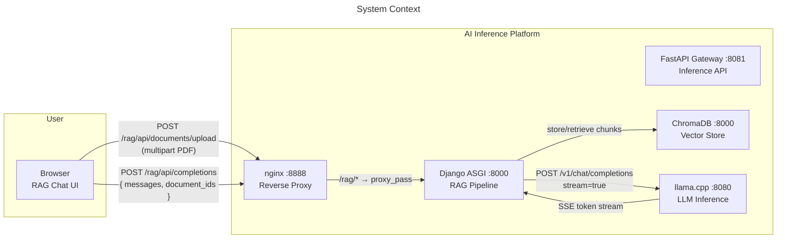
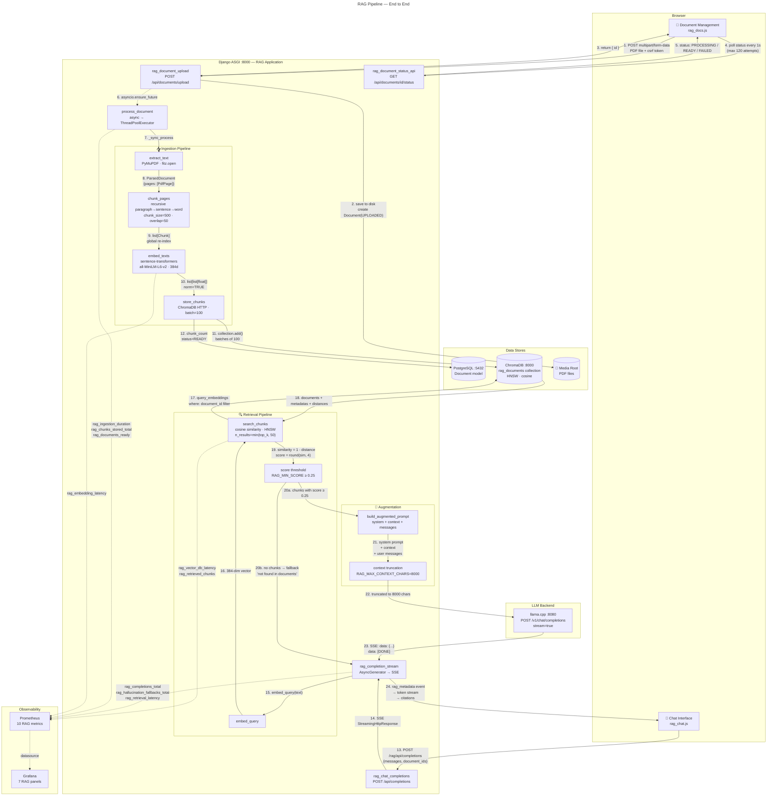

# RAG Pipeline Architecture

## Overview

Retrieval-Augmented Generation pipeline embedded in the Django control plane. Users upload PDFs, which are ingested through a text extraction → chunking → embedding → vector storage pipeline. Chat queries are answered by retrieving relevant chunks from ChromaDB, augmenting the prompt with grounded context, and streaming the LLM response through to the browser.

---

## System Context



---

## Full Pipeline — Ingestion + Inference



---

## Ingestion Pipeline Detail

```
                            ┌─────────────────────────┐
                            │   PDF Upload             │
                            │   POST /api/documents/   │
                            │   upload                 │
                            │   multipart/form-data    │
                            └───────────┬─────────────┘
                                        │
                                        ▼
                            ┌─────────────────────────┐
                            │   1. Validate            │
                            │   • extension == .pdf    │
                            │   • file_size ≤ 50 MB   │
                            └───────────┬─────────────┘
                                        │
                                        ▼
                            ┌─────────────────────────┐
                            │   2. Save to disk        │
                            │   • uuid-based filename  │
                            │   • MEDIA_ROOT / {id}.pdf│
                            │   • Document(UPLOADED)   │
                            └───────────┬─────────────┘
                                        │
                              ┌─────────▼──────────┐
                              │  Background Process │
                              │  asyncio.ensure_    │
                              │  future → executor  │
                              └─────────┬──────────┘
                                        │
                             ┌──────────▼──────────┐
                             │  3. extract_text()   │
                             │  PyMuPDF (fitz)      │
                             │  • page.get_text()   │
                             │  • per-page error    │
                             │    resilience        │
                             │  • metadata: pages,  │
                             │    chars, filename   │
                             └──────────┬──────────┘
                                        │
                             ┌──────────▼──────────┐
                             │  4. chunk_pages()    │
                             │  Per page:           │
                             │  • paragraph split   │
                             │  • sentence fallback │
                             │  • word fallback     │
                             │  • overlap=50 chars  │
                             │  • global re-index   │
                             └──────────┬──────────┘
                                        │
                             ┌──────────▼──────────┐
                             │  5. embed_texts()    │
                             │  sentence-transformers│
                             │  • all-MiniLM-L6-v2  │
                             │  • batch all chunks  │
                             │  • normalize=True    │
                             │  • 384-dim output    │
                             └──────────┬──────────┘
                                        │
                             ┌──────────▼──────────┐
                             │  6. store_chunks()   │
                             │  ChromaDB HTTP       │
                             │  • batches of 100    │
                             │  • id: {doc}_chunk_{i}│
                             │  • metadata: doc_id, │
                             │    chunk_index, page │
                             └──────────┬──────────┘
                                        │
                                        ▼
                             ┌──────────────────────┐
                             │  Document(READY)     │
                             │  chunk_count=N       │
                             └──────────────────────┘
```

### Key design decisions

| Decision | Rationale |
|---|---|
| **Background processing via ThreadPoolExecutor** | PyMuPDF and sentence-transformers are synchronous (GIL-bound). Running them in a thread pool avoids blocking the ASGI event loop without requiring separate worker processes |
| **Paragraph-aware chunking with sentence fallback** | Preserves semantic boundaries (paragraphs) where possible. Falls back to sentences for oversized paragraphs. Word-level split is the last resort for pathological cases |
| **Global chunk re-indexing** | After per-page chunking, all chunks are re-numbered globally so `chunk_index` is monotonically increasing and `id` is collision-free across pages |
| **Batch embedding** | All chunks for a document are embedded in a single `model.encode()` call, which is more efficient than per-chunk calls (batch processing in transformer models is highly optimized) |
| **batched ChromaDB insert** | ChromaDB performs better with moderate batch sizes (100). Too large batches cause memory pressure; too many small batches cause HTTP overhead |

---

## Inference Pipeline Detail

```
User message ──► 1. Extract last user message
                        │
                        ▼
                2. embed_query(message)
                   • same sentence-transformers model
                   • single text → 384-dim vector
                        │
                        ▼
                3. search_chunks(query_emb, top_k=5)
                   • ChromaDB HNSW cosine search
                   • optional document_id filter
                   • returns { text, score, metadata }
                        │
                        ▼
                4. Filter by score ≥ 0.25
                        │
                ┌───────┴───────┐
                ▼               ▼
           score≥0.25       score<0.25
                │               │
                │               ▼
                │         Hallucination Fallback
                │         • yield rag_metadata{found:false}
                │         • yield "not found in documents"
                │         • increment counter
                │         • return
                │
                ▼
        5. build_augmented_prompt()
           • format context:
             [Source: {doc_id}, page {n}]
             {chunk_text}
           • truncate to 8000 chars
           • build messages:
             [system prompt, ...user messages]
                │
                ▼
        6. Send to llama.cpp
           • ChatCompletionRequest
           • stream=true
           • max_tokens=1024
           • temperature=0.7
                │
                ▼
        7. Stream response
           • yield rag_metadata SSE event
             { found, chunks_retrieved, citations }
           • forward token SSE events
           • yield [DONE]
                │
                ▼
        8. On HTTP 400 (context overflow):
           • truncate context to 2000 chars
           • reduce max_tokens to 128
           • retry once
```

### Anti-Hallucination Strategy

| Layer | Mechanism | Implementation |
|---|---|---|
| **Confidence threshold** | `RAG_MIN_SCORE=0.25` | Chunks below cosine similarity 0.25 are discarded. If no chunks survive, the model explicitly says "not found" |
| **System prompt** | Hard-coded instruction | "Answer based ONLY on the provided context. Do NOT use your training data. If the context does not contain enough information, say EXACTLY: 'I could not find this information in the uploaded documents.'" |
| **Source grounding** | Every chunk prefixed with provenance | `[Source: {document_id}, page {page}]` — the model sees the source for every fact |
| **No fabricated citations** | Citations from retrieval metadata | Citation data comes from the retrieval step, not from model output. Sent as structured `rag_metadata` SSE events alongside the token stream |
| **Hallucination fallback metric** | `rag_hallucination_fallbacks_total` | Counter incremented whenever the system returns "not found" — alerts on unexpected patterns (e.g., frequent fallbacks when documents exist) |
| **Context window limit** | `RAG_MAX_CONTEXT_CHARS=8000` | Prevents oversized prompts from diluting relevant context signal |
| **Context overflow retry** | HTTP 400 handling | If llama.cpp rejects the prompt due to context length, truncates and retries with reduced max_tokens |

---

## Component Reference

### URL Routes

| Path | View | Method | Purpose |
|---|---|---|---|
| `chat/` | `RagChatView.get()` | GET | Renders chat interface |
| `documents/` | `RagDocumentsView.get()` | GET | Renders document management page |
| `api/documents/` | `rag_document_list_api` | GET | Lists all documents as JSON |
| `api/documents/upload` | `rag_document_upload` | POST | Uploads a PDF file |
| `api/documents/<id>/status` | `rag_document_status_api` | GET | Returns document status |
| `api/documents/<id>/file` | `rag_document_file` | GET | Serves the original PDF file |
| `api/documents/<id>/delete` | `rag_document_delete` | POST | Deletes document + chunks |
| `api/completions` | `rag_chat_completions` | POST | RAG-augmented chat completion (SSE) |
| `api/health` | `rag_health` | GET | ChromaDB connectivity check |

### Service Modules

| File | Key Exports | Purpose |
|---|---|---|
| `services/pdf_parser.py` | `extract_text()`, `PdfPage`, `ParsedDocument`, `PdfParseError` | PyMuPDF text extraction per page |
| `services/chunker.py` | `chunk_document()`, `chunk_pages()`, `Chunk` | Recursive paragraph→sentence→word chunking with configurable size/overlap |
| `services/embeddings.py` | `embed_texts()`, `embed_query()` | sentence-transformers wrapper with lazy loading and lock-protected singleton |
| `services/vector_store.py` | `store_chunks()`, `search_chunks()`, `delete_document_chunks()`, `health()` | ChromaDB HTTP client with batched operations and cosine similarity search |
| `services/rag_completion.py` | `rag_completion_stream()`, `build_augmented_prompt()`, `format_citations()` | Orchestrates retrieval → augmentation → generation → SSE streaming |
| `services/document_processor.py` | `process_document()` | Async background pipeline: extract → chunk → embed → store |

---

## Data Models

### Document (PostgreSQL)

| Field | Type | Description |
|---|---|---|
| `id` | UUID (PK, default uuid4) | Unique document identifier |
| `original_filename` | `CharField(512)` | Original uploaded filename |
| `file_path` | `CharField(1024)` | Absolute path to saved PDF |
| `file_size_bytes` | `IntegerField(default=0)` | File size in bytes |
| `page_count` | `IntegerField(nullable)` | Number of pages extracted |
| `chunk_count` | `IntegerField(default=0)` | Number of chunks stored |
| `status` | `CharField(20)` | One of: UPLOADED, PROCESSING, READY, FAILED |
| `error_message` | `TextField(blank)` | Error details if FAILED |
| `uploaded_by` | FK → `auth.User` (nullable) | User who uploaded |
| `created_at` | `DateTimeField(auto_now_add)` | Upload timestamp |
| `updated_at` | `DateTimeField(auto_now)` | Last update timestamp |

### Chunk (ChromaDB)

| Field | Type | Description |
|---|---|---|
| `id` | `str` | `{document_id}_chunk_{index}` |
| `text` | `str` (document) | Chunk text content |
| `document_id` | `str` (metadata) | FK to Document.id |
| `chunk_index` | `int` (metadata) | Global sequential index |
| `page_number` | `int` (metadata) | Source page number |
| *embedding* | `list[float]` (384d) | L2-normalized embedding vector |

---

## Configuration Reference

### RAG Settings

| Env Variable | Default | Description |
|---|---|---|
| `RAG_ENABLED` | `true` | Master feature toggle |
| `RAG_CHUNK_SIZE` | `500` | Target characters per chunk |
| `RAG_CHUNK_OVERLAP` | `50` | Characters of overlap between consecutive chunks |
| `RAG_TOP_K` | `5` | Number of chunks retrieved per query |
| `RAG_MIN_SCORE` | `0.25` | Minimum cosine similarity for chunk inclusion |
| `RAG_EMBEDDING_MODEL` | `all-MiniLM-L6-v2` | sentence-transformers model name |
| `RAG_MAX_CONTEXT_CHARS` | `8000` | Maximum context characters in augmented prompt |
| `CHROMADB_HOST` | `chromadb` | ChromaDB server hostname |
| `CHROMADB_PORT` | `8000` | ChromaDB HTTP API port |
| `CHROMADB_COLLECTION` | `rag_documents` | ChromaDB collection name |

### Inference Settings

| Env Variable | Default | Description |
|---|---|---|
| `INFERENCE_DEFAULT_MAX_TOKENS` | `1024` | Default max_tokens for generation |
| `INFERENCE_HARD_MAX_TOKENS` | `8092` | Hard cap on max_tokens |
| `INFERENCE_DEFAULT_TEMPERATURE` | `0.7` | Default temperature |
| `INFERENCE_DEFAULT_TOP_P` | `0.9` | Default top_p |
| `INFERENCE_UPSTREAM_TIMEOUT_S` | `600.0` | httpx read timeout for llama.cpp |
| `LLAMA_CPP_BASE_URL` | `http://127.0.0.1:8080` | llama.cpp server URL |

---

## Observability

### Prometheus Metrics

| Metric | Type | Description |
|---|---|---|
| `rag_ingestion_duration_seconds` | Histogram | Time to ingest and index a document (buckets: 1,2,5,10,30,60,120,300) |
| `rag_embedding_latency_seconds` | Histogram | Time to generate embeddings per batch (buckets: 0.01,0.05,0.1,0.5,1.0,2.0,5.0) |
| `rag_retrieval_latency_seconds` | Histogram | Time to retrieve chunks from vector DB (buckets: 0.01,0.05,0.1,0.25,0.5,1.0,2.0) |
| `rag_vector_db_latency_seconds` | Histogram | Raw ChromaDB operation time (same buckets) |
| `rag_retrieved_chunks_per_query` | Histogram | Chunks retrieved per query (buckets: 0,1,2,3,5,8,10,15) |
| `rag_completions_total` | Counter | Total RAG-augmented chat completions |
| `rag_hallucination_fallbacks_total` | Counter | "Not found" responses due to low confidence |
| `rag_documents_uploaded_total` | Counter | Total documents uploaded |
| `rag_chunks_stored_total` | Counter | Total chunks stored |
| `rag_documents_ready` | Gauge | Count of documents with status=ready |

### Grafana Dashboard Panels

| Panel | Type | Description |
|---|---|---|
| RAG Request Rate | Stat | Completions per second |
| Hallucination Fallbacks | Stat | "Not found" count — alerts on hallucination risk |
| Documents Ready | Stat | Number of indexed documents |
| Ingestion & Chunks Rate | Stat | Document upload and chunk storage rate |
| Retrieval Latency p50/p95 | Timeseries | Time to embed, search, and filter |
| Avg Chunks Retrieved per Query | Timeseries | Retrieval depth over time |
| Ingestion Duration | Timeseries | Document processing time |

---

## Data Flow Walkthroughs

### Document Ingestion

```
Browser                           Django                           ChromaDB
  │                                 │                                │
  │  POST /api/documents/upload     │                                │
  │  (multipart, PDF file)          │                                │
  ├───────────────────────────────►│                                │
  │                                 │  Validate file (.pdf, ≤50MB)  │
  │                                 │  Generate UUID filename       │
  │                                 │  Save to MEDIA_ROOT/{id}.pdf  │
  │                                 │  Document.objects.create(     │
  │                                 │    status=UPLOADED)           │
  │  { id, status: "uploaded" }    │                                │
  │◄───────────────────────────────┤                                │
  │                                 │  asyncio.ensure_future(        │
  │                                 │    process_document(id))       │
  │                                 │                                │
  │  GET /api/documents/{id}/status │  ┌──────────────────┐         │
  │───────────────────────────────►│  │ _sync_process    │         │
  │  { status: "processing" }     │  │  extract_text()  │         │
  │◄───────────────────────────────┤  │  chunk_pages()   │         │
  │  (poll every 1s)               │  │  embed_texts()   │         │
  │                                │  │  store_chunks()  │────────►│
  │  { status: "ready",           │  │                  │  add()   │
  │    page_count, chunk_count }   │  │  Document(READY) │         │
  │◄───────────────────────────────┤  └──────────────────┘         │
```

### RAG Chat Completion

```
Browser                           Django                           ChromaDB          llama.cpp
  │                                 │                                │                  │
  │  POST /api/completions          │                                │                  │
  │  { messages, document_ids }    │                                │                  │
  ├───────────────────────────────►│                                │                  │
  │                                 │  _extract_last_user_message    │                  │
  │                                 │  embed_query(text)            │                  │
  │                                 │  search_chunks(embed,top_k=5) │                  │
  │                                 │──────────────────────────────►│                  │
  │                                 │  ◄─── documents + distances ──│                  │
  │                                 │                                │                  │
  │                                 │  filter(score ≥ 0.25)         │                  │
  │                                 │  build_augmented_prompt()      │                  │
  │                                 │  ChatCompletionRequest(stream) │                  │
  │                                 │────────────────────────────────────────────────►│
  │                                 │                                │                  │
  │  data: {"type":"rag_metadata", │                                │  SSE stream      │
  │    "found":true,               │                                │◄─────────────────│
  │    "chunks_retrieved":3,       │                                │                  │
  │    "citations":[...]}          │                                │                  │
  │◄───────────────────────────────┤                                │                  │
  │                                 │                                │                  │
  │  data: {"choices":[{"delta":   │                                │                  │
  │    {"role":"assistant",        │                                │                  │
  │     "content":"Based on..."}]}]│                                │                  │
  │◄───────────────────────────────┤                                │                  │
  │  (token stream continues)     │                                │                  │
  │◄───────────────────────────────┤                                │                  │
  │                                 │                                │                  │
  │  data: [DONE]                  │                                │                  │
  │◄───────────────────────────────┤                                │                  │
  │                                 │                                │                  │
  │  Render citations:             │                                │                  │
  │  [doc_id… p.3] [doc_id… p.5]  │                                │                  │
```

---

## Key Design Decisions

| Decision | Rationale |
|---|---|
| **RAG in Django (not gateway)** | Django owns the ORM, admin UI, templates, and session auth. Adding RAG to Django avoids cross-service file transfers for PDF ingestion, keeps the gateway focused on inference orchestration, and leverages existing LlamaCppBackend for the generation step |
| **sentence-transformers for embeddings** | Embedding via llama.cpp is ~1-2s per chunk; sentence-transformers/all-MiniLM-L6-v2 is ~10ms. For batch ingestion of 100+ chunks, the difference is 100s vs 1s |
| **ChromaDB over pgvector** | ChromaDB is purpose-built for vector search with cosine similarity, HNSW indexing, and metadata filtering. No Postgres extension needed. Independent service with persistent volume |
| **Paragraph-aware chunking** | Preserves semantic boundaries at the paragraph level where possible. Falls back to sentences for oversized paragraphs. Overlap is computed from trailing sentences, not raw characters — preserves semantic boundaries |
| **Cosine similarity (not dot product)** | Embeddings are L2-normalized, making cosine similarity equivalent to dot product. Cosine is more intuitive (bounded [0,1] for positive vectors) and ChromaDB's HNSW with cosine space handles this natively |
| **SSE for RAG metadata** | Citations and retrieval metadata are sent as structured SSE events before the token stream begins. The frontend can render citation badges immediately without parsing model output |
| **Async views with sync services** | The ASGI view is async, but core services (PyMuPDF, sentence-transformers, ChromaDB HTTP) are synchronous. Django's `sync_to_async` and `run_in_executor` bridge the gap without requiring full async rewrites |
| **No-chunks fallback** | If no chunks pass the score threshold, the system returns a hardcoded "not found" response rather than letting the model answer from training data. The `rag_hallucination_fallbacks_total` counter provides observability into how often this occurs |

---

## Error Handling

| Scenario | Mechanism | Behavior |
|---|---|---|
| PDF parsing failure | try/except per page, `PdfParseError` | Failed pages get empty text; total failure sets Document(FAILED) with error message |
| ChromaDB unavailable | HTTP exception propagates to caller | Document stays in PROCESSING state; next status poll shows FAILED |
| Embedding model load failure | `threading.Lock()` singleton, exception on first call | First document processing attempt fails; subsequent attempts retry model load |
| Context length exceeded | HTTP 400 from llama.cpp | `_truncate_context()` reduces to 2000 chars, retries with max_tokens=128 |
| Client disconnect | `asyncio.CancelledError` in SSE generator | Streaming stops; no partial response stored |
| llama.cpp timeout | `httpx.ReadTimeout → UpstreamTimeoutError` | Propagates as HTTP 504 to client |
| llama.cpp unavailable | `httpx.RequestError → UpstreamUnavailableError` | Propagates as HTTP 502 to client |
